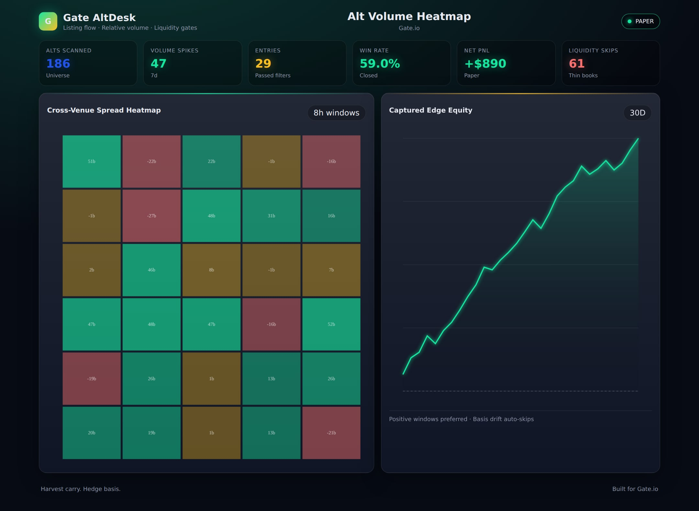
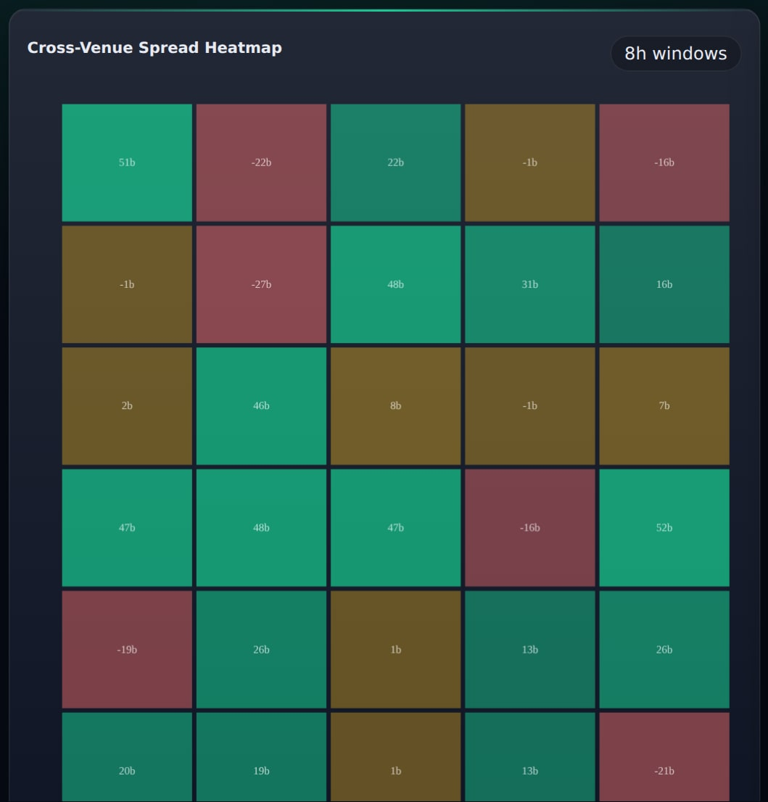
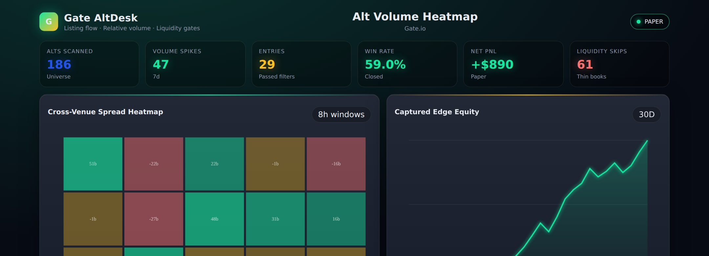
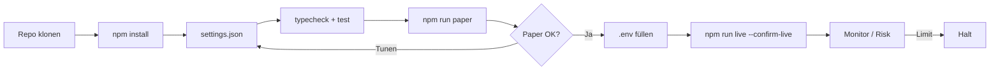
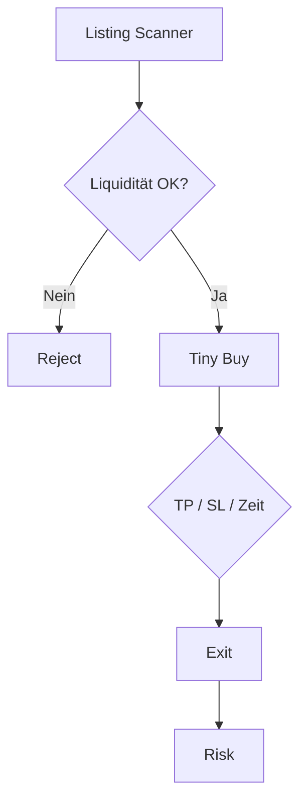

<p align="center">
  
</p>

# Gate.io Alt Trading Bot

<p align="center">
  <strong>Alt breadth with spot/futures dual-mode execution</strong><br/>
  gate · paper + live · risk-gated · MIT
</p>

<p align="center">
  
  
  
  
</p>

<p align="center">
  Sprachen: [English](README.md) · [中文](README.zh.md) · **Deutsch** · [Español](README.es.md)
</p>

> **Suchbegriffe:** gate.io trading bot · gateio bot · gate.io futures · altcoin trading bot

---

## Performance-Snapshot

Demo-Analytics aus dem statischen Dashboard (`npm run dashboard`). Banner und Strategie-Diagramme bleiben erhalten.

<p align="center">
  
</p>

<p align="center">
  
</p>

<p align="center">
  
</p>

---

## Projekt-Workflow

Klonen → konfigurieren → Paper → Credentials → Live. Risk immer an.



| | |
|--|--|
| `npm run paper` | Zuerst Paper — keine API-Keys |
| `npm run dashboard` | Lokales Analytics-Dashboard öffnen (statisch) |
| `npm run live` | Benötigt `--confirm-live` + API-Credentials |

---

## Platform-Fit

| | |
|--|--|
| Venue | gate |
| Märkte | both |
| Edge | Alt breadth with spot/futures dual-mode execution |
| Execution | CCXT Live (Sandbox) + Paper |

---

## Handelsstrategie

MEXC/Gate.io stehen für **Alt-Breadth & Early Listings**. Der Bot scannt, filtert dünne Books/Blacklists, kauft winzig und exit’t mechanisch (TP/SL/Zeit). Kontrolliertes Lotterieticket — kein Core-Portfolio.

### So funktioniert es
- **Listing-Scanner** mit Liquidität/Alter.
- **Liquidity Guard** (`minLiquidityUsd`).
- **Blacklist**.
- **Tiny Entry** (`maxBuyUsd`).
- **Mechanische Exits**.
- **Gate Dual-Mode** Helper für Spot/Swap.

### Wann der Edge erscheint
**Bestes Regime:** hohe Listing-Velocity; nur Risikokapital.

### Wann es scheitert
**Scheitert bei:** Rugs, Wash-Liquidity, Spreads > TP.

### Schlüsselparameter (`settings.json`)
- `maxBuyUsd`/`minLiquidityUsd`
- TP/SL/Hold
- `blacklist`

### Strategiespezifische Risiken
- Die meisten Listing-Trades verlieren.
- Keine Withdraw-Rechte am API-Key.


---

## Strategie-Diagramm



---

## Architektur

```
src/
  config/     Zod settings + env loader
  strategy/   venue-specific engine
  broker/     paper + CCXT live adapters
  risk/       daily loss / drawdown / caps
  app/        runtime loop
  alts/
  dual/
  liquidity/
```

---

## Schnellstart

```bash
cd gate-io-alt-trading-bot
npm install
npm run typecheck
npm test
npm run paper
```

### Live

```bash
cp .env.example .env
# set GATE_API_KEY + GATE_API_SECRET
# optional GATE_PASSWORD / PASSPHRASE
npm run live
```

---

## Konfiguration

`settings.json` — strategy + risk + paper/live flags.  
`.env` — secrets only (see `.env.example`).

---

## Risiko & Sicherheit

- Live refuses without `--confirm-live` and API credentials
- Prefer `live.sandbox: true` until proven
- Disable withdrawals on exchange API keys
- Daily loss / drawdown / notional caps + kill switch

---

## Haftungsausschluss

MIT-Bildungssoftware — **keine Finanzberatung**. CEX-Trading kann Totalverlust bedeuten.

## Lizenz

MIT — siehe [LICENSE](LICENSE).
