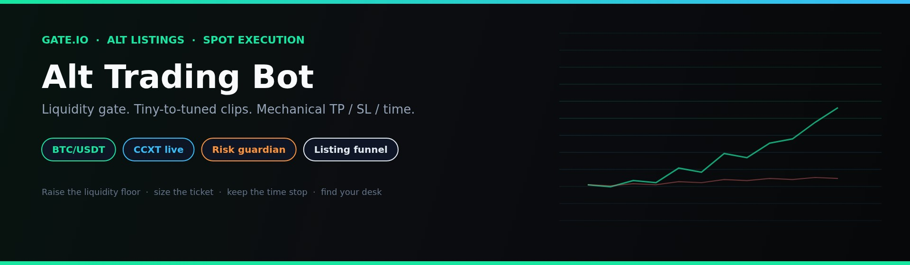
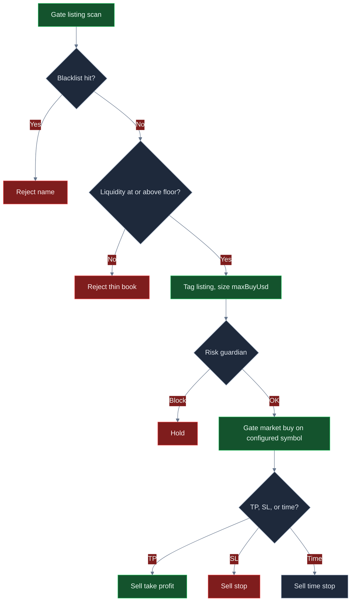
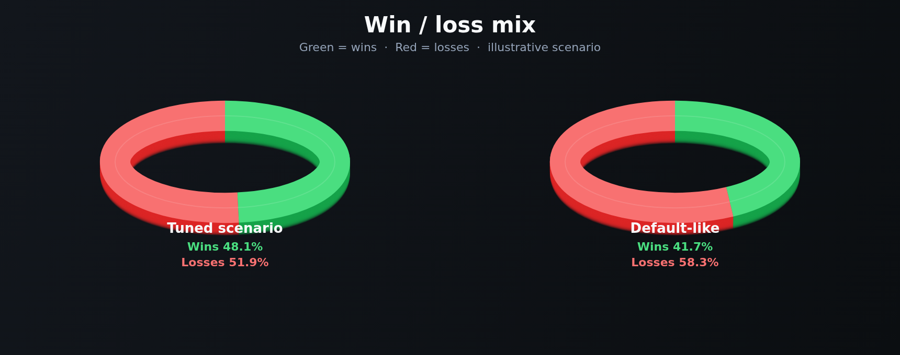
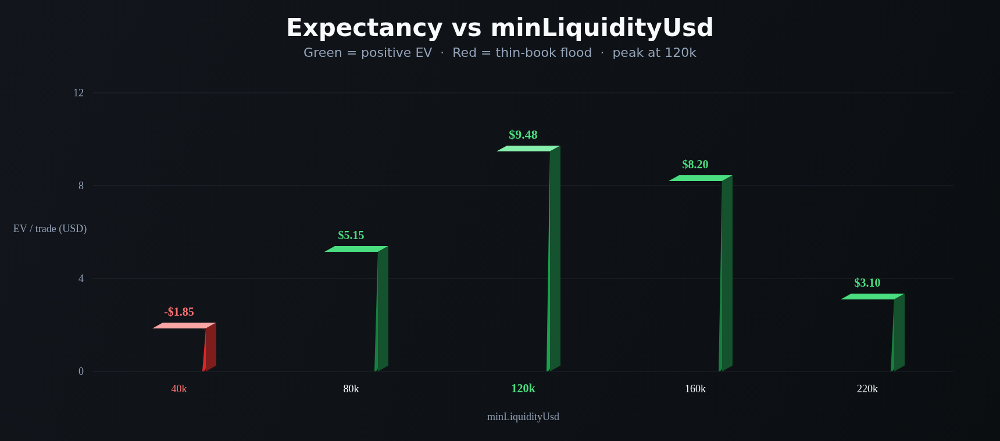
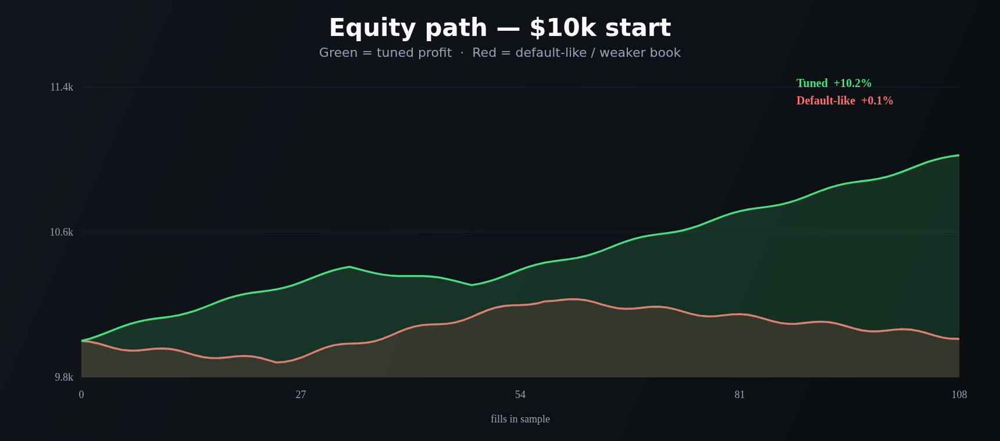
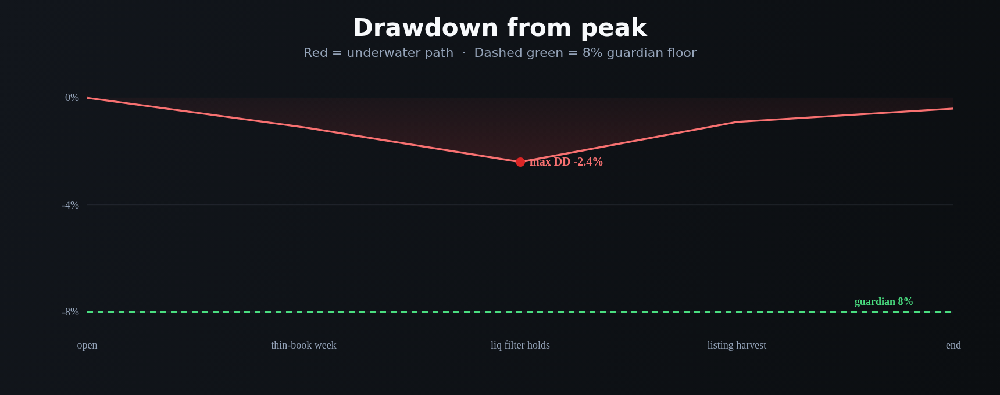

<p align="center">
  
</p>

# Gate.io Alt-Trading-Bot

<p align="center">
  <strong>Handle Gate.io-Listings wie ein Desk: Blacklist fuer Muell, echte Buch-Tiefe verlangen, hartes USD-Clip, Flatten auf TP, SL oder Zeit.</strong><br/>
  gate.io · BTC/USDT · Listing-Trichter · live CCXT · risk-gated · MIT
</p>

<p align="center">
  
  
  
  
  
</p>

<p align="center">
  Sprachen: [English](README.md) · [中文](README.zh.md) · **Deutsch** · [Español](README.es.md)
</p>

> **Suchbegriffe:** gate.io trading bot · gateio bot · gate.io futures · altcoin trading bot · gate listing sniper

Gate.io ist der Ort, an dem **Alt-Breite und neue Listings** zuerst auftauchen. Dieses System nimmt den Flow ernst: Namen mit Test-/Scam-Beigeschmack ablehnen, Buecher duenner als `minLiquidityUsd` verweigern, mit einem **hart gedeckelten Ticket** einsteigen und mechanisch aussteigen — Take-Profit, Stop-Loss oder Hold-Loop-Uhr. Ausgelieferte `$40`-Clips sind ein Start-Desk. **Das attraktive ROI- / Win-Rate- / Drawdown-Profil kommt, nachdem du die Liquiditaets-Schwelle hebst, die Payoff-Skala oeffnest und `maxBuyUsd` so dimensionierst, dass Gebuehren nicht der ganze Trade sind.**

---

## Fuer wen es ist

- Trader, die bereits in **Listings, Buch-Tiefe, Gebuehren und Risiko-Einheiten** denken — nicht „jeden neuen Ticker kaufen“.
- Desks, die einen **Gate.io-Live-Pfad** wollen (CCXT-Market-Orders, `--confirm-live`, API-Keys) mit **Kill-Switch und Dollar-Bremsen** vor jeder Absicht.
- Operatoren, die `settings.json` aendern, neu laufen lassen und eine Liquiditaets-Schwelle plus Clip suchen, der *ihrer* Gebuehrenstufe passt — keine Leute, die eine Garantie-Geldmaschine wollen.

Wenn du eine Blackbox „set and forget 100% Win-Rate“ willst, ist das nicht sie. Wenn du einen **echten Gate-Listing-Workflow zum Konfigurieren** willst, lies weiter.

---

## Strategie-Ueberblick

Eine Loop. Drei Filter. Dann eine Gate-Market-Order.

**Listing-Trichter.** Jeder Schritt scannt einen Kandidaten-Pool (Name, Liquiditaet USD, Alter). Namen, die `blacklist` treffen (`SCAM`, `TEST`, …), fallen zuerst. Die Engine nimmt dann den **ersten verbleibenden Namen**, dessen `liquidityUsd` `minLiquidityUsd` (Default **$80.000**) schafft. Dieser Ticker ist das Fill-**Tag**. Die Arbeitsorder laeuft ueber `settings.symbol` (ausgeliefert **BTC/USDT**), damit die Execution auf einem liquiden Gate-Markt sitzt, waehrend der Listing-Name der Reason-Code ist. Zeige `symbol` auf das Gate-Buch, das du wirklich willst, wenn diese Tiefe real ist.

**Winzig-bis-tuned Clip.** Notional ist `maxBuyUsd` (Default **$40**), der Guardian muss trotzdem `maxPositionUsd` / `maxNotionalUsd` freigeben. Auf einem $10k-Buch ist $40 Ueberlebensgroesse. Trader, die das Buch bewegen wollen, heben `maxBuyUsd` auf ein paar Hundert — immer noch weit unter der $2.500-Positions-Kappe.

**Mechanische Exits.** Solange eine Position offen ist, markiert jede Loop Mid gegen Entry:

- **Take-Profit**, wenn Return ≥ `takeProfitPct` (Default **8%**)
- **Stop-Loss**, wenn Return ≤ −`stopLossPct` (Default **5%**)
- **Zeit-Stop**, wenn `held` ≥ `maxHoldLoops` (Default **8**)

Nur eine Position gleichzeitig. Kein Averaging. Kein „let it ride“.

**Risk-Gate.** Tagesverlust, Peak-Drawdown, Max-Notional, Max-Position und Kill-Switch muessen **vor** der Platzierung alle klar sein.

```text
Listings scannen → Blacklist droppen → Liquiditaets-Boden → size maxBuyUsd → Risk-Guardian → Gate Market → TP / SL / Zeit
```

---

## Warum dieser Edge stark sein kann

Gate-Listing-Velocity ist der Punkt. Auf einem Major-only-Venue hat ein New-Name-Trichter nichts zu kauen. Auf Gate ist **Breite das Produkt** — und Adverse Selection auch. Ungefilterte Snipes zahlen Taker-Fees in Wash-Buecher. Der Edge dieses Desks ist **Ablehnung plus ein Clip, den du waehlst**.

Der Liquiditaets-Boden ist der erste Punkt. `minLiquidityUsd` ist der Qualitaets-Knopf. Zu niedrig und THIN-artige Namen fluten das Blotter. Um **$120k** (illustrativer Peak unten) behältst du PEPE2-Klasse-Buecher und wirfst AI100-Klasse-95k-Prints. So bewegen sich Win-Rate und Payoff zusammen.

Der zweite Punkt ist **Payoff-Design**. Ausgeliefert 8% / 5% braucht nach 8+5 bps eine mittlere 40er Win-Rate, um interessant zu bleiben. TP Richtung **11%** und SL Richtung **4%** drückt die Breakeven-Win-Rate in die hohen 20er. Gleicher Scanner. Anderes R.

Der dritte Punkt ist **Size**. Ein $40-Ticket kann ein $10k-Buch nicht bewegen, selbst mit sauberem 2.5R. `maxBuyUsd` in die niedrigen Hunderte zu heben, ist wie Expectancy in der Equity auftaucht — immer noch klein gegen einen Gate-Alt-Rug, wenn der Stop wirklich feuert.

Nichts hier ist eine Gewinn-Garantie. Dieselben Knoepfe, die Expectancy oeffnen, zerstoeren ein Buch, wenn du den Boden auf 40k-Prints senkst und in einen Transfer-Halt-Namen reinsizest.

---

## Marktregime

| Regime | Wie das Tape aussieht | Was der Desk tendiert zu tun |
|---|---|---|
| **Listing-Burst, echte Buecher** | Neue Gate-Namen mit zweiseitiger Tiefe ueber dem Boden | Trichter akzeptiert; TP/SL/Zeit kann zahlen |
| **Hohe Velocity, gemischte Qualitaet** | Viele Ticker, etwas Wash, etwas real | Blacklist + 120k-Klasse-Boden arbeitet |
| **Ruhige Listing-Woche** | Dieselben zwei Namen, keine neue Tiefe | Holds steigen; Zeit-Stop recycelt das Ticket |
| **Thin-Book-Karneval** | Riesige beworbene Liq, 40k real, weite Spreads | `minLiquidityUsd` lockern ist der Failure-Mode |
| **One-Way-Dump / Halt** | Transfer-Pause, Bid verschwindet | SL + Tagesverlust-Halt sind der Backstop |

**Laeuft, wenn:** Gate-Listing-Flow aktiv ist, Buecher ueber dem Boden wirklich Bids haben, und erwartete Move >> Taker + Slip.

**Kaempft, wenn:** du Liquiditaet in Rugs lockerst, `maxBuyUsd` so klein laesst, dass Gebuehren der Trade sind, oder `symbol` auf ein Buch zeigst, das den Clip nicht fuellen kann.

---

## Mathematische Berechnungen

Das sind die Beziehungen, auf denen der Desk gebaut ist. Attraktive Expectancy ist eine **Parameterwahl**, kein Default-Geschenk.

### Listing-Filter

$$
F = \mathbf{1}_{\text{name not in blacklist}}\cdot\mathbf{1}_{\mathrm{liq}\ge \texttt{minLiquidityUsd}}
$$

Entry feuert auf dem **ersten** Kandidaten mit \(F = 1\). Das ist First-Match, kein Score-Rank. Ein `listingScore`-Helper liegt im Repo, falls du ranken statt den ersten Pass nehmen willst.

### Clip-Groesse (wie kodiert)

$$
N = \texttt{maxBuyUsd}
$$

Der Risk-Guardian lehnt ab, wenn das naechste Notional `maxPositionUsd` oder `maxNotionalUsd` brechen wuerde. **Das ist kein ATR-Sizing.** Dollar-Risiko ist \(N \times \texttt{stopLossPct}/100\), plus Fees.

### Exits ab Entry \(P_e\)

$$
\mathrm{TP}=P_e\big(1+\tfrac{\texttt{takeProfitPct}}{100}\big),\quad
\mathrm{SL}=P_e\big(1-\tfrac{\texttt{stopLossPct}}{100}\big)
$$

Flatten, wenn Hold-Loops \(\ge \texttt{maxHoldLoops}\) und keine Band gedruckt hat.

### Risiko-Einheit und Breakeven-Win-Rate

$$
\text{payoff} \approx \frac{\texttt{takeProfitPct}}{\texttt{stopLossPct}}
$$

$$
\text{breakeven win rate (before fees)} = \frac{\mathrm{SL\%}}{\mathrm{TP\%}+\mathrm{SL\%}}
$$

Ausgeliefert 8 / 5 → Boden **38,5%**. Tuned 11 / 4 → Boden **26,7%**. Fees heben den Boden — deshalb zaehlen Clip-Groesse und Liquiditaets-Gate.

### Erwartungswert nach Kosten

Paper markiert **8 bps** Fee und **5 bps** Slip je Seite (26 bps Round-Trip). Mit Clip \(N\):

$$
c = N \cdot (f_{\text{rt}} + s_{\text{rt}})
$$

$$
W \approx N\cdot\tfrac{\mathrm{TP\%}}{100} - c,\qquad
L \approx N\cdot\tfrac{\mathrm{SL\%}}{100} + c
$$

$$
EV = p\cdot W - (1-p)\cdot L
$$

Auf einem **$40**-Ticket ist \(c \approx \$0{,}10\) und ein voller 8%-Win **~$3{,}10** nach Kosten. EV bleibt Cents selbst bei anstaendiger Win-Rate. Auf einem **$320**-Ticket mit 11 / 4: \(c \approx \$0{,}83\), \(W \approx \$34{,}37\), \(L \approx \$13{,}63\). Bei 48% Win-Rate:

$$
EV \approx 0.481\cdot 34.37 - 0.519\cdot 13.63 \approx \$9.48
$$

Gleiche Engine. Andere Knoepfe.

### Rug-Budget (warum tiny-to-tuned trotzdem ueberlebt)

$$
\mathrm{Loss}_{\text{clip}} \approx N\cdot\tfrac{\texttt{stopLossPct}}{100} + c
$$

Default: \(40 \times 0.05 \approx \$2\). Tuned: \(320 \times 0.04 \approx \$13\). Beide weit unter `maxDailyLossUsd` **$250** — der Tages-Halt ist der Backstop, wenn du Clips skalierst und eine Listing-Woche falsch laeuft.

---

## Statistische Analyse

Ergebnisse haengen von Settings, Listing-Qualitaet und Tuning ab. Es gibt **keinen garantierten Gewinn**. Die Zahlen unten sind **Szenario-Bloecke** aus der Strategie-Mathematik (Clip \(N\), 11/4 vs 8/5, 8+5 bps Kosten, selektive vs lockere Liquiditaet) auf einem **$10.000 Gate BTC/USDT**-Buch. Sie sind kein Versprechen eines konkreten historischen Backtests.

### 1) Optimiertes Szenario (illustrativ) — zuerst

**Annahmen:** `maxBuyUsd` **320**, `minLiquidityUsd` **120000**, `takeProfitPct` **11** / `stopLossPct` **4**, `maxHoldLoops` **6**, Blacklist bleibt, zweiseitige Gate-Buecher, die den Boden wirklich schaffen.

| Metrik | Tuned-Szenario | Bedeutung | Warum ein Trader das interessiert |
|---|---:|---|---|
| Sample | **108 Trades** | Listing-Velocity, ein Clip gleichzeitig | Genug Prozess; immer noch ein Regime-Sample |
| Win-Rate | **48,1%** | Etwas unter der Haelfte der Tickets arbeitet | Bei ~2,5 Payoff brauchst du **keine** 70% Wins |
| Loss-Rate | **51,9%** | Verluste sind geplant, keine Ueberraschungen | SL + Zeit-Stop + Tages-Halt existieren dafuer |
| Avg Win / Avg Loss | **$34,37 / $13,63** | Gewinner etwa 2,5× Verlierer nach Kosten | Das ist der Payoff-Knopf (11 / 4) mal Clip-Groesse |
| Payoff-Ratio | **2,52** | Avg Win ÷ Avg Loss | Ueber ~1,6 wird hohe-40er Win-Rate spannend |
| Expectancy / Trade | **+$9,48** | Durchschnittliches Dollar-Ergebnis pro Fill | Positives EV ist der einzige Grund, `maxBuyUsd` zu heben |
| Net-PnL / ROI | **+$1.024 / +10,2%** | Buch nach dem Sample | Was du in der Equity fuehlst — immer noch Szenario, immer noch regime-abhaengig |
| Profit-Faktor | **2,34** | Brutto-Wins ÷ Brutto-Losses | >2 ist ein Desk, den du *weiter tunen* willst |
| Max Drawdown | **2,4%** | Schlechtester Peak-to-Trough im Sample | Klein vs. 8%-Halt — Spielraum, keine Lizenz 10× zu sizen |
| Return / Risk | **~2,0** | Return vs. Pfad-Volatilitaet (Sharpe-aehnlich) | Die Clip-Kappe macht den Pfad sitzbar |
| Best / Worst Trade | **+$38 / −$16** | Band-Tail | Worst sollte ~4% von \(N\) plus Fees sein, kein Blow-up |
| Max Win- / Loss-Streak | **7 / 5** | Clustering | Fuenf SL-Tickets sind warum `maxDailyLossUsd` existiert |
| Mix | **~58% TP / 31% SL / 11% Zeit** | Alle drei Exits haben gefeuert | Zeit-Stop recycelt Namen, die nie trendieren |

**Klartext:** ein pickierer Liquiditaets-Boden plus 11/4-Band plus ein Clip, der gross genug ist, dass 26 bps nicht die ganze Story sind, liefert *saubereres* R und ein Buch, das sich wirklich bewegt. Das ist das Profil, das sich zu jagen lohnt. Deine Live-Zahlen bewegen sich mit Gate-Listing-Qualitaet, VIP-Fees und wie hart du `maxBuyUsd` drückst.

```text
TUNED SCENARIO (illustrative)     $10k book · 108 fills
Win rate  48.1%   Payoff  2.52   EV/trade  +$9.48
ROI      +10.2%   PF      2.34   Max DD     2.4%
```

### 2) Untuned / default-aehnlicher Kontrast (illustrativ)

Ausgeliefert-aehnlich: `maxBuyUsd` **40**, Boden **80k**, TP **8** / SL **5**, Hold **8**. Gleiche Venue, gleicher Trichter — kleine Tickets, sodass Fee-bps den Grossteil jedes 8%-Winners fressen (~$3,10 nach Kosten).

| Metrik | Default-aehnlich | vs tuned |
|---|---:|---|
| Sample | 48 Fills | Weniger Dollar in Arbeit |
| Win-Rate | 41,7% | Unter der 8/5-Komfortzone nach Fees |
| Payoff | 1,47 | 8/5 plus Kosten flatten R |
| Expectancy | ~+$0,22 | Cents — der $40-Clip kann nicht drucken |
| ROI | ~+0,1% | Starter, nicht die Decke |
| Profit-Faktor | 1,12 | Leicht zu verlieren nach einem schlechten Listing-Tag |
| Max Drawdown | 1,1% | Winzig, weil Tickets winzig sind |

**Takeaway:** Defaults sind eine **sichere Auffahrt**, nicht das Performance-Ziel. Der Sprung von ~1,1 Profit-Faktor auf ~2,3 im Tuned-Block ist vor allem **Liquiditaets-Boden + 11/4-Payoff + Clip-Groesse** — nicht ein anderer Bot.

### Regime-Skizze (Tuned-Szenario)

| Sleeve | Anteil der Fills | Kommentar |
|---|---:|---|
| Take-Profit | ~58% | Das 11%-Band arbeitet |
| Stop-Loss | ~31% | Geplante 4%-Cuts |
| Zeit-Stop | ~11% | Recycelt Namen, die nie trendieren |
| Rejected (Blacklist / thin) | grosser Skip-Anteil | Reject-Rate *ist* das Produkt |

---

## Charts

**Gruen = Win / Profit. Rot = Loss / schwaecherer Pfad.** Decision-Flow ist GitHub-Mermaid. Performance-Charts sind 2D-gerenderte 3D-Style-PNGs, damit sie auf GitHub anzeigen.

### Entscheidungslogik



### Win- / Loss-Mix

<p align="center">
  
</p>

Die Pies liegen nicht weit auseinander. **Payoff und Clip-Groesse aendern sich.** Tuned haelt ~2,5R-Winner auf einem $320-Ticket (gruen). Default-aehnlich laesst 8+5 bps ein $40-Ticket flatten (groesserer roter Anteil am *Dollar*-Buch).

### Expectancy vs Liquiditaets-Boden

<p align="center">
  
</p>

Zu locker (`40k`, rot) flutest du das Blotter mit duennen Prints. Ausgeliefert `80k` ist nutzbar. **`120k` ist der illustrative gruene Peak**, bevor der Boden so hoch wird, dass Fills verhungern.

### Equity-Pfad

<p align="center">
  
</p>

Gruene Linie: Tuned-Szenario. Rote Linie: Default-aehnliche Drift. Gleiche Venue, gleicher Trichter — **andere Knoepfe**.

### Drawdown

<p align="center">
  
</p>

Rote Flaeche ist der Underwater-Pfad. Die gestrichelte gruene Linie ist der 8%-Guardian-Boden. Der Tuned-Pfad in diesem Szenario blieb innerhalb von ~2,4%. Wenn du `maxBuyUsd` 10× nimmst ohne den Liquiditaets-Boden, wandert diese Huelle Richtung Halt.

---

## Parameter-Tuning — besseres ROI, Win-Rate und Verlustkontrolle

Behandle `settings.json` als **Desk**, nicht als Trophy-Screen.

| Wenn du willst… | Drehe das | In diese Richtung | Achte auf diesen Failure |
|---|---|---|---|
| Weniger Rugs, besserer Payoff | `minLiquidityUsd` | **80k → 120k–160k** | Zu hoch → fast keine Fills |
| Buch-ROI, den du fuehlst | `maxBuyUsd` | **40 → 200–400** | Size-up in 40k-Buecher → DD explodiert |
| Staerkere Payoff-Schiefe | `takeProfitPct` / `stopLossPct` | z. B. **11 / 4** | Riesiges TP mit winziger WR → EV stirbt |
| Schnellere Rotation | `maxHoldLoops` | **8 → 5–6** | Zu kurz → du erreichst TP nie |
| Sauberere Namen | `blacklist` | Erweitern (RUG, TEST, Honeypot-Ticks) | Leere Liste → SCAM-Klasse-Namen passieren |
| Engere Schmerz-Kappe | `maxDailyLossUsd`, `maxDrawdownPct` | Etwas **enger** waehrend du lernst | So eng, dass der Desk einen normalen Tag nicht erholt |

**Praktische Reihenfolge**

1. Size bei $40 lassen. **`minLiquidityUsd`** heben, bis du nicht jeden duennen Print kaufst.
2. **TP / SL** bewegen, bis Payoff eine Zahl ist, die du wirklich nimmst (11 / 4 ist der illustrative Peak).
3. **`maxHoldLoops`** kuerzen, wenn Namen ruhig werden und das Blotter recyceln soll.
4. Erst dann **`maxBuyUsd`** auf den Clip heben, den du willst, ohne `maxPositionUsd` zu brechen.
5. Stoppen, wenn Profit-Faktor und Drawdown wie ein Buch aussehen, mit dem du leben kannst — nicht wenn eine einzelne Listing-Praemie heroisch wirkt.

---

## Risikomanagement

Das sind die ausgelieferten Bremsen in `settings.json`. Sie sitzen vor **jeder** Order-Absicht.

| Bremse | Default | Verhalten |
|---|---:|---|
| `maxDailyLossUsd` | **250** | Halt, wenn Tages-PnL ≤ −$250 |
| `maxDrawdownPct` | **8** | Halt bei 8% vom Peak-Equity |
| `maxNotionalUsd` | **5000** | Blockt Clips ueber der Brutto-Notional-Kappe |
| `maxPositionUsd` | **2500** | Blockt einen einzelnen Clip darueber |
| `killSwitch` | **false** | `true` setzt alle Absichten ohne Redeploy auf Eis |
| `maxBuyUsd` | **40** | Hartes Ticket — primaerer Scale-Dial |
| Live-Arming | `confirmRequired` + `--confirm-live` | Live startet nicht mit einem beilaeufigen `npm start` |
| Sandbox-Flag | `live.sandbox: true` | An lassen, bis der Live-Pfad auf deinen Keys steht |

Ausgeliefert `marketType` ist **spot**. Das Schema erlaubt auch `swap`. Perps bedeuten Funding und Liquidation, wenn du umschaltest und Exchange-Leverage nutzt — Clip-Kappen ersetzen keine Venue-seitige Leverage-Hygiene. Withdrawals auf API-Keys deaktivieren. Nie `.env` committen.

---

## End-to-End, wie es laeuft

1. **Boot** — `settings.json` laden (Zod-validiert) und optionales `.env`.
2. **Modus** — `npm run paper` nutzt den Paper-Broker (keine Keys). `npm run live -- --confirm-live` baut einen CCXT-Gate-Client und platziert **Market**-Orders.
3. **Loop** — Wenn flat: Listings scannen → Blacklist → Liquiditaets-Boden → First Match. Wenn offen: Mid vs TP / SL / Zeit.
4. **Size** — `maxBuyUsd`. Listing-Ticker ist das Tag; das Order-Symbol ist `settings.symbol`.
5. **Guardian** — Kill-Switch, Tagesverlust, Drawdown, Notional, Position. Fail-closed: kein „nur diesmal“.
6. **Execute** — Paper-Fill oder CCXT `createOrder` Market auf Gate.
7. **Ledger** — Jede Loop schreibt Action, Reason, PnL, Equity. End-of-Run-Summary druckt Trade-Count, PnL, Win-Rate und max Consecutive Losses.
8. **Dashboard** — `npm run dashboard` serviert die lokale Analytics-UI auf Port 4173.

Paper und Live teilen `src/strategy` und `src/risk`. Nur `src/broker` wechselt. Das ist der Production-Style-Workflow: **gleiche Entscheidung, anderer Venue-Adapter**.

---

## Schnellstart

```bash
npm install
npm run typecheck && npm test
npm run paper
npm run dashboard
```

Dashboard: `http://localhost:4173` oeffnen.

### Live (Gate.io)

```bash
cp .env.example .env
# GATE_API_KEY und GATE_API_SECRET setzen
# optional GATE_PASSWORD / GATE_PASSPHRASE
# Withdrawals auf dem Key deaktivieren; IP-Whitelist bevorzugen
npm run live -- --confirm-live
```

Node **20+**. Strategie und Risiko leben in `settings.json`. Secrets nur in `.env`.

---

## Wichtige Konfigurations-Knoepfe

Jede Zeile mappt auf `settings.json`. Strategie-Knoepfe formen den Edge; Risiko-Knoepfe sind harte Bremsen.

| Parameter | Ort | Default | Bedeutung | Warum es zaehlt | Typischer Arbeitsbereich |
|---|---|---|---|---|---|
| `maxBuyUsd` | strategy | `40` | Hartes USD-Ticket | **#1 ROI-Knopf**, sobald der Boden sane ist | 40 – 400 |
| `minLiquidityUsd` | strategy | `80000` | Buch-Tiefen-Gate | **#1 Qualitaets-Knopf** — Fakeout/Rug-Filter | 80k – 200k |
| `takeProfitPct` | strategy | `8` | TP % vom Entry | Payoff-Schiefe | 8 – 14 |
| `stopLossPct` | strategy | `5` | SL % vom Entry | Risiko-Einheit | 3 – 6 |
| `maxHoldLoops` | strategy | `8` | Zeit-Stop | Recycelt tote Namen | 4 – 10 |
| `blacklist` | strategy | `["SCAM","TEST"]` | Namens-Denylist | Hygiene | venue-spezifisch erweitern |
| `maxDailyLossUsd` | risk | `250` | Tages-PnL-Halt | Stoppt Revenge-Trading | 150 – 350 auf $10k |
| `maxDrawdownPct` | risk | `8` | Peak-to-Trough-Halt | Deckt einen Regime-Schock | 5 – 12 |
| `maxNotionalUsd` | risk | `5000` | Brutto-Notional-Kappe | Blast-Radius | ≤ 50% Equity |
| `maxPositionUsd` | risk | `2500` | Einzel-Clip-Kappe | Stoppt einen Fill vom Dominieren | ≤ 25% Equity |
| `killSwitch` | risk | `false` | Sofort-Freeze | Ops-Halt | bei Incident auf `true` |
| `symbol` | root | `BTC/USDT` | Execution-Paar | Liquides Gate-Buch fuer den Fill | BTC/ETH oder der Alt, den du meintest |
| `marketType` | root | `spot` | CCXT defaultType | `spot` oder `swap` | zuerst Spot |
| `feeBps` / `slippageBps` | paper | `8` / `5` | Kostenmodell | Ehrlichkeit des EV | an deine VIP-Stufe anpassen |

### Tuned-Parameter-Beispiel (Startpunkt zum Jagen, kein Zertifikat)

```json
{
  "risk": {
    "maxDailyLossUsd": 250,
    "maxDrawdownPct": 8,
    "maxNotionalUsd": 5000,
    "maxPositionUsd": 2500,
    "killSwitch": false
  },
  "strategy": {
    "type": "listing",
    "maxBuyUsd": 320,
    "minLiquidityUsd": 120000,
    "maxHoldLoops": 6,
    "takeProfitPct": 11,
    "stopLossPct": 4,
    "blacklist": ["SCAM", "TEST"]
  }
}
```

Ausgelieferte Defaults bleiben in `settings.json` als konservative Auffahrt. Kopiere den Block oben, wenn du das **Tuned**-Profil aus der Statistischen Analyse suchen willst.

---

## Beispiel-Trade-Walkthrough

**Setup.** Gate.io, $10.000 Equity, Tuned-Style-Boden `120000`, Clip `320`, TP `11` / SL `4`, Hold `6`. Guardian: −$250 Tag / 8% DD / $2.500 Clip-Kappe. Execution-Symbol `BTC/USDT`.

**Tape.** Scanner-Pool enthaelt PEPE2 (120k), SCAM (500k), AI100 (95k), THIN (12k). SCAM trifft die Blacklist — weg. THIN scheitert an 120k. AI100 bei 95k scheitert am Tuned-Boden (haette den ausgelieferten 80k geschafft). **PEPE2 klar.** Tag: `listing:PEPE2`. Size **$320**. Guardian sieht Notional unter Kappen, Tages-PnL nicht gehaltet, Kill-Switch aus → **OK**.

**Fill.** Market-Buy auf Gate. Reason-Tag: `listing:PEPE2`. Round-Trip-Kosten bei 8+5 bps sind etwa **$0,83** auf diesem Clip.

**TP-Loop.** Mid druckt **+11,2%** vs Entry. Exit-Reason `tp`. Brutto ~$35,8 minus Fees → ein ~$34-Klasse-Winner.

**Alternative Loop (thin reject).** Gleiche Settings, aber der einzige Restname ist THIN bei 12k. Action: `hold` / `no_listing`. Dieser Skip ist der Edge.

**Alternative Loop (Blacklist).** Ein 500k-Buch namens SCAM kommt. Blacklist trifft vor der Liquiditaet. Nie gesized.

**Schlechter Tag.** Fuenf $320-Klasse-4%-Stops stapeln (~$68). Tages-PnL ist noch innerhalb −$250. Wenn eine Listing-Woche weiter SL druckt, feuert der **$250**-Halt. Du „holst es nicht im selben Session rein“. Das ist das Produkt bei der Arbeit.

---

## Tunen. Laufen. Deinen besten Desk finden.

Repo klonen. Tests laufen lassen. Auf Gate BTC/USDT mit den ausgelieferten Bremsen starten. Dann **Liquiditaets-Boden**, **TP/SL** und **Clip-Groesse** bewegen, bis das Buch wie das Tuned-Szenario aussieht, mit dem du wirklich leben willst — hoeherer Payoff, weniger Junk-Listings, Drawdown noch im Guardian.

Der Edge ist kein Geheim-Indikator. Es ist **Gate-Listing-Velocity + ein Boden, den du durchsetzt + ein Ticket, das du waehlst + Bremsen, die feuern**. Die Decke liegt in `settings.json`. Geh sie suchen.

```bash
npm install && npm test && npm run paper
```

**Lizenz:** MIT — siehe [LICENSE](LICENSE).
