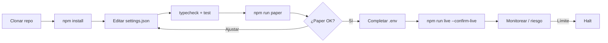
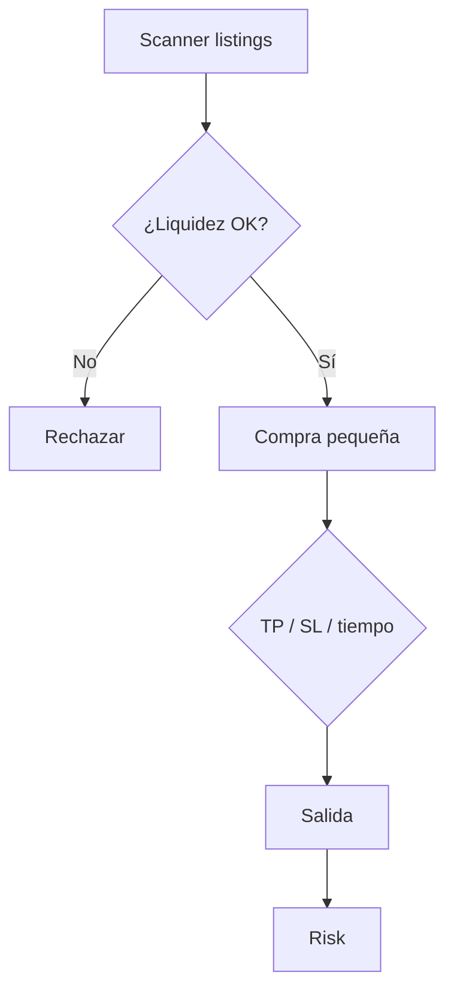

<p align="center">
  
</p>

# Gate.io Alt Trading Bot

<p align="center">
  <strong>Alt breadth with spot/futures dual-mode execution</strong><br/>
  gate · paper + live · risk-gated · MIT
</p>

<p align="center">
  
  
  
  
</p>

<p align="center">
  Idiomas: [English](README.md) · [中文](README.zh.md) · [Deutsch](README.de.md) · **Español**
</p>

> **Palabras clave:** gate.io trading bot · gateio bot · gate.io futures · altcoin trading bot

---

## Instantánea de rendimiento

Analítica demo del dashboard estático incluido (`npm run dashboard`). El banner y los diagramas de estrategia se mantienen.

<p align="center">
  
</p>

<p align="center">
  
</p>

<p align="center">
  
</p>

---

## Flujo del proyecto

Clonar → configurar → paper → credenciales → live. Riesgo siempre activo.



| | |
|--|--|
| `npm run paper` | Primero paper — sin API keys |
| `npm run dashboard` | Abrir dashboard de analítica local (estático) |
| `npm run live` | Requiere `--confirm-live` + credenciales API |

---

## Encaje con la plataforma

| | |
|--|--|
| Venue | gate |
| Mercados | both |
| Edge | Alt breadth with spot/futures dual-mode execution |
| Ejecución | CCXT live (sandbox) + paper |

---

## Estrategia de trading

MEXC y Gate.io destacan por **amplitud de alts y listings tempranos**. Este bot escanea, rechaza libros finos/blacklist, entra con **maxBuyUsd minúsculo** y sale por **TP/SL/tiempo**. Es un boleto de lotería controlado, no el núcleo del portfolio.

### Cómo funciona
- **Scanner de listings** con liquidez/edad.
- **Guard de liquidez**.
- **Blacklist**.
- **Entrada tiny**.
- **Salidas mecánicas**.
- **Helper dual-mode** (Gate) spot/swap.

### Cuándo aparece el edge
**Mejor régimen:** alta velocidad de listings; solo capital de riesgo.

### Cuándo se rompe
**Falla cuando:** rugs, liquidez falsa, spreads > TP.

### Parámetros clave (`settings.json`)
- `maxBuyUsd`/`minLiquidityUsd`
- TP/SL/hold
- `blacklist`

### Notas de riesgo de la estrategia
- Asume que la mayoría pierde.
- Sin permisos de retiro en la API key.


---

## Diagrama de estrategia



---

## Arquitectura

```
src/
  config/     Zod settings + env loader
  strategy/   venue-specific engine
  broker/     paper + CCXT live adapters
  risk/       daily loss / drawdown / caps
  app/        runtime loop
  alts/
  dual/
  liquidity/
```

---

## Inicio rápido

```bash
cd gate-io-alt-trading-bot
npm install
npm run typecheck
npm test
npm run paper
```

### Live

```bash
cp .env.example .env
# set GATE_API_KEY + GATE_API_SECRET
# optional GATE_PASSWORD / PASSPHRASE
npm run live
```

---

## Configuración

`settings.json` — strategy + risk + paper/live flags.  
`.env` — secrets only (see `.env.example`).

---

## Riesgo y seguridad

- Live refuses without `--confirm-live` and API credentials
- Prefer `live.sandbox: true` until proven
- Disable withdrawals on exchange API keys
- Daily loss / drawdown / notional caps + kill switch

---

## Aviso legal

Software educativo MIT — **no es asesoramiento financiero**. El trading en CEX puede causar pérdida total.

## Licencia

MIT — ver [LICENSE](LICENSE).
