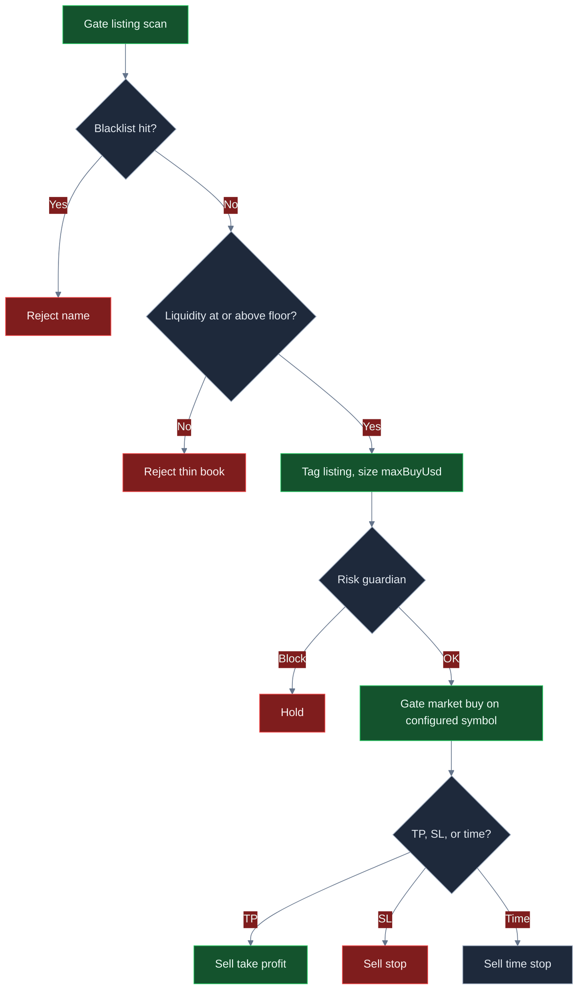

<p align="center">
  
</p>

# Bot de trading de alts de Gate.io

<p align="center">
  <strong>Opera el flujo de listings de Gate.io como un desk: blacklist de basura, profundidad real de libro, clip USD duro, y cierra en TP, SL o tiempo.</strong><br/>
  gate.io · BTC/USDT · embudo de listing · live CCXT · risk-gated · MIT
</p>

<p align="center">
  
  
  
  
  
</p>

<p align="center">
  Idiomas: [English](README.md) · [中文](README.zh.md) · [Deutsch](README.de.md) · **Español**
</p>

> **Palabras de busqueda:** gate.io trading bot · gateio bot · gate.io futures · altcoin trading bot · gate listing sniper

Gate.io es donde **la amplitud de alts y los listings nuevos** aparecen primero. Este sistema esta hecho para tomar ese flujo en serio: rechazar nombres con olor a test o estafa, rechazar libros mas delgados que `minLiquidityUsd`, entrar con un **ticket con tope duro**, y salir de forma mecanica — take-profit, stop-loss o reloj de hold. Los clips de **$40** de fabrica son un desk de arranque. **El perfil atractivo de ROI / win rate / drawdown aparece cuando subes el piso de liquidez, abres el payoff y dimensionas `maxBuyUsd` para que las comisiones no sean todo el trade.**

---

## Para quien es

- Traders que ya piensan en **listings, profundidad de libro, comisiones y unidades de riesgo** — no en “comprar cada ticker nuevo”.
- Desks que quieren una **ruta live de Gate.io** (ordenes market CCXT, `--confirm-live`, API keys) con **kill switch y frenos en dolares** delante de cada intencion.
- Operadores que cambiaran `settings.json`, relanzaran y buscaran un piso de liquidez + clip que encaje con *su* tarifa — no gente que busca una maquina de dinero garantizado.

Si quieres una caja negra “set and forget 100% win rate”, esto no es. Si quieres un **flujo real de listings de Gate que puedes configurar**, sigue leyendo.

---

## Resumen de la estrategia

Un loop. Tres filtros. Luego una orden market en Gate.

**Embudo de listing.** Cada paso escanea un pool de candidatos (nombre, liquidez USD, edad). Primero caen los nombres que coinciden con `blacklist` (`SCAM`, `TEST`, …). El motor toma el **primer nombre restante** cuyo `liquidityUsd` supera `minLiquidityUsd` (default **$80,000**). Ese ticker es el **tag** del fill. La orden de trabajo va por `settings.symbol` (de fabrica **BTC/USDT**) para que la ejecucion siente en un mercado liquido de Gate mientras el nombre del listing es el codigo de razon. Apunta `symbol` al libro de Gate que realmente quieres cuando esa profundidad es real.

**Clip de chico a tuned.** El nocional es `maxBuyUsd` (default **$40**); el guardian igual debe pasar `maxPositionUsd` / `maxNotionalUsd`. En un libro de $10k, $40 es tamano de supervivencia. Quienes quieren que el libro se mueva suben `maxBuyUsd` hacia unos cientos — todavia muy por debajo del tope de posicion de $2,500.

**Salidas mecanicas.** Con posicion abierta, cada loop marca mid vs entrada:

- **Take-profit** si el retorno ≥ `takeProfitPct` (default **8%**)
- **Stop-loss** si el retorno ≤ −`stopLossPct` (default **5%**)
- **Stop de tiempo** si `held` ≥ `maxHoldLoops` (default **8**)

Solo una posicion a la vez. Sin promediar. Sin “dejarlo correr”.

**Puerta de riesgo.** Perdida diaria, drawdown de pico, nocional max, posicion max y kill switch deben pasar **antes** de colocar.

```text
escanear listings → tirar blacklist → piso de liquidez → size maxBuyUsd → risk guardian → market Gate → TP / SL / tiempo
```

---

## Por que este edge puede ser potente

La velocidad de listings de Gate es el punto. En un venue solo de majors, un embudo de nombres nuevos no tiene que masticar. En Gate, **la amplitud es el producto** — y la seleccion adversa tambien. Los snipes sin filtro pagan taker fees a libros lavados. El edge de este desk es **rechazo mas un clip que tu elegiste**.

El piso de liquidez es el primer punto. `minLiquidityUsd` es el knob de calidad. Demasiado bajo y nombres estilo THIN inundan el blotter. Cerca de **$120k** (pico ilustrativo abajo) te quedas con libros clase PEPE2 y tiras prints clase AI100 de 95k. Asi se mueven juntos win rate y payoff.

El segundo punto es el **diseno de payoff**. El 8% / 5% de fabrica necesita un win rate de mediados de 40 solo para seguir interesante despues de 8+5 bps. Sube TP hacia **11%** y aprieta SL hacia **4%** y el win rate de equilibrio cae a los 20 altos. Mismo scanner. Distinto R.

El tercer punto es el **size**. Un ticket de $40 no mueve un libro de $10k, aunque el 2.5R este limpio. Subir `maxBuyUsd` a unos pocos cientos es como la expectativa aparece en el equity — todavia pequeno frente a un rug de alt de Gate si el stop realmente dispara.

Nada aqui es garantia de beneficio. Los mismos knobs que abren expectativa destrozan un libro si bajas el piso a prints de 40k y agrandas size en un nombre con halt de transferencias.

---

## Regimenes de mercado

| Regimen | Como se ve el tape | Que tiende a hacer el desk |
|---|---|---|
| **Rafaga de listings, libros reales** | Nombres nuevos de Gate con profundidad a dos lados sobre el piso | El embudo acepta; TP/SL/tiempo puede pagar |
| **Alta velocidad, calidad mixta** | Muchos tickers, algo de wash, algo real | Blacklist + piso clase 120k hace el trabajo |
| **Semana quieta de listings** | Los mismos dos nombres, sin profundidad nueva | Aumentan los holds; el time stop recicla el ticket |
| **Carnaval de libro fino** | Liq anunciada enorme, 40k real, spreads anchos | Aflojar `minLiquidityUsd` es el modo de fallo |
| **Dump de un lado / halt** | Pausa de transferencias, desaparece el bid | SL + halt de perdida diaria son el backstop |

**Crece cuando:** el flujo de listings de Gate esta activo, los libros que pasan el piso realmente tienen bids, y el movimiento esperado >> taker + slip.

**Sufre cuando:** aflojas liquidez hacia rugs, dejas `maxBuyUsd` tan chico que las fees son el trade, o apuntas `symbol` a un libro que no puede llenar el clip.

---

## Calculos matematicos

Estas son las relaciones sobre las que esta construido el desk. La expectativa atractiva es una **eleccion de parametros**, no un regalo de defaults.

### Filtro de listing

$$
F = \mathbf{1}_{\text{name not in blacklist}}\cdot\mathbf{1}_{\mathrm{liq}\ge \texttt{minLiquidityUsd}}
$$

La entrada dispara en el **primer** candidato con \(F = 1\). Es first-match, no un ranking por score. Existe un helper `listingScore` en el repo si quieres rankear en vez de tomar el primer pase.

### Tamano de clip (como esta en codigo)

$$
N = \texttt{maxBuyUsd}
$$

El guardian de riesgo rechaza la intencion si el siguiente nocional romperia `maxPositionUsd` o `maxNotionalUsd`. **Esto no es sizing ATR.** El riesgo en dolares es \(N \times \texttt{stopLossPct}/100\), mas fees.

### Salidas desde la entrada \(P_e\)

$$
\mathrm{TP}=P_e\big(1+\tfrac{\texttt{takeProfitPct}}{100}\big),\quad
\mathrm{SL}=P_e\big(1-\tfrac{\texttt{stopLossPct}}{100}\big)
$$

Cerrar cuando los loops de hold \(\ge \texttt{maxHoldLoops}\) si ninguna banda imprimio.

### Unidad de riesgo y win rate de equilibrio

$$
\text{payoff} \approx \frac{\texttt{takeProfitPct}}{\texttt{stopLossPct}}
$$

$$
\text{breakeven win rate (before fees)} = \frac{\mathrm{SL\%}}{\mathrm{TP\%}+\mathrm{SL\%}}
$$

De fabrica 8 / 5 → piso **38.5%**. Tuned 11 / 4 → piso **26.7%**. Las fees suben el piso — por eso importan el clip y la puerta de liquidez.

### Valor esperado despues de costos

Paper marca **8 bps** de fee y **5 bps** de slip por lado (26 bps ida y vuelta). Con clip \(N\):

$$
c = N \cdot (f_{\text{rt}} + s_{\text{rt}})
$$

$$
W \approx N\cdot\tfrac{\mathrm{TP\%}}{100} - c,\qquad
L \approx N\cdot\tfrac{\mathrm{SL\%}}{100} + c
$$

$$
EV = p\cdot W - (1-p)\cdot L
$$

En un ticket de **$40**, \(c \approx \$0.10\) y un win completo del 8% es **~$3.10** despues de costo. El EV se queda en centavos aunque el win rate sea decente. En un ticket de **$320** con 11 / 4, \(c \approx \$0.83\), \(W \approx \$34.37\), \(L \approx \$13.63\). Con win rate 48%:

$$
EV \approx 0.481\cdot 34.37 - 0.519\cdot 13.63 \approx \$9.48
$$

Mismo motor. Distintos knobs.

### Presupuesto de rug (por que tiny-to-tuned igual sobrevive)

$$
\mathrm{Loss}_{\text{clip}} \approx N\cdot\tfrac{\texttt{stopLossPct}}{100} + c
$$

Default: \(40 \times 0.05 \approx \$2\). Tuned: \(320 \times 0.04 \approx \$13\). Ambos muy por debajo de `maxDailyLossUsd` **$250** — el halt diario es el backstop cuando escalas clips y una semana de listings sale al reves.

---

## Analisis estadistico

Los resultados dependen de settings, calidad de listing y como tunes. **No hay beneficio garantizado.** Las cifras abajo son **bloques de escenario** construidos con la matematica de la estrategia (clip \(N\), bandas 11/4 vs 8/5, costos 8+5 bps, liquidez selectiva vs suelta) en un libro **Gate BTC/USDT de $10,000**. No son la promesa de un backtest historico concreto.

### 1) Escenario optimizado (ilustrativo) — primero

**Supuestos:** `maxBuyUsd` **320**, `minLiquidityUsd` **120000**, `takeProfitPct` **11** / `stopLossPct` **4**, `maxHoldLoops` **6**, blacklist intacta, libros de Gate a dos lados que realmente pasan el piso.

| Metrica | Escenario tuned | Que significa | Por que le importa a un trader |
|---|---:|---|---|
| Muestra | **108 trades** | Velocidad de listing, un clip a la vez | Suficiente para ver proceso; sigue siendo un regimen |
| Win rate | **48.1%** | Un poco menos de la mitad de los tickets funciona | Con payoff ~2.5 **no** necesitas 70% de wins |
| Loss rate | **51.9%** | Las perdidas estan planeadas, no son sorpresas | SL + time stop + halt diario existen para este lado |
| Avg win / avg loss | **$34.37 / $13.63** | Ganadores ~2.5× perdedores despues de costos | Es el knob de payoff (11 / 4) por tamano de clip |
| Ratio de payoff | **2.52** | Avg win ÷ avg loss | Por encima de ~1.6, un win rate de 40 altos se vuelve convincente |
| Expectativa / trade | **+$9.48** | Resultado promedio en dolares por fill | EV positivo es la unica razon para subir `maxBuyUsd` |
| PnL neto / ROI | **+$1,024 / +10.2%** | Libro despues de la muestra | Lo que sientes en el equity — sigue siendo escenario, sigue dependiendo del regimen |
| Profit factor | **2.34** | Wins brutos ÷ losses brutos | >2 es un desk que *quieres* seguir tunando |
| Max drawdown | **2.4%** | Peor pico a valle en la muestra | Chico vs el halt del 8% — margen, no licencia para 10× size |
| Return / risk | **~2.0** | Retorno vs volatilidad del path (tipo Sharpe) | El tope de clip hace el path soportable |
| Mejor / peor trade | **+$38 / −$16** | Cola de la banda | El peor deberia verse como ~4% de \(N\) mas fees, no un blow-up |
| Max racha win / loss | **7 / 5** | Clustering | Cinco tickets SL son por que existe `maxDailyLossUsd` |
| Mix | **~58% TP / 31% SL / 11% tiempo** | Las tres salidas dispararon | El time stop recicla nombres que nunca trendean |

**En cristiano:** un piso de liquidez mas picky mas banda 11/4 mas un clip lo bastante grande para que 26 bps no sean toda la historia produce R *mas limpio* y un libro que de verdad se mueve. Ese es el perfil que vale la pena cazar. Tus numeros live se moveran con la calidad de listings de Gate, las fees VIP y que tan duro empujes `maxBuyUsd`.

```text
TUNED SCENARIO (illustrative)     $10k book · 108 fills
Win rate  48.1%   Payoff  2.52   EV/trade  +$9.48
ROI      +10.2%   PF      2.34   Max DD     2.4%
```

### 2) Contraste sin tunear / tipo default (ilustrativo)

Tipo fabrica: `maxBuyUsd` **40**, piso **80k**, TP **8** / SL **5**, hold **8**. Misma venue, mismo embudo — tickets chicos para que los bps de fee se coman la mayor parte de cada winner del 8% (~$3.10 despues de costo).

| Metrica | Tipo default | vs tuned |
|---|---:|---|
| Muestra | 48 fills | Menos dolares trabajando |
| Win rate | 41.7% | Debajo de la zona comoda 8/5 despues de fees |
| Payoff | 1.47 | 8/5 mas costos aplastan R |
| Expectativa | ~+$0.22 | Centavos — el clip de $40 no imprime |
| ROI | ~+0.1% | Arranque, no el techo |
| Profit factor | 1.12 | Facil de perder despues de un mal dia de listings |
| Max drawdown | 1.1% | Minimo porque los tickets son minimos |

**Takeaway:** los defaults son una **rampa segura**, no el objetivo de performance. El salto de ~1.1 de profit factor a ~2.3 en el bloque tuned es sobre todo **piso de liquidez + payoff 11/4 + tamano de clip** — no otro bot.

### Boceto de regimen (escenario tuned)

| Manga | Cuota de fills | Comentario |
|---|---:|---|
| Take-profit | ~58% | La banda del 11% hace el trabajo |
| Stop-loss | ~31% | Cortes planeados del 4% |
| Time stop | ~11% | Recicla nombres que nunca trendean |
| Rechazados (blacklist / thin) | gran cuota de skip | La tasa de rechazo *es* el producto |

---

## Graficos

**Verde = win / profit. Rojo = loss / camino mas debil.** El flujo de decision es Mermaid de GitHub. Los graficos de performance son PNG 2D con profundidad estilo 3D para que se vean en GitHub.

### Logica de decision



### Mix win / loss

<p align="center">
  
</p>

Los pies no estan tan lejos. **Lo que cambia es payoff y tamano de clip.** Tuned guarda winners ~2.5R en un ticket de $320 (verde). Tipo default deja que 8+5 bps aplasten un ticket de $40 (mayor cuota roja del libro *en dolares*).

### Expectativa vs piso de liquidez

<p align="center">
  
</p>

Demasiado suelto (`40k`, rojo) inunda el blotter con prints finos. El `80k` de fabrica es usable. **`120k` es el pico verde ilustrativo** antes de que el piso suba tanto que los fills se mueran de hambre.

### Camino de equity

<p align="center">
  
</p>

Linea verde: escenario tuned. Linea roja: deriva tipo default. Misma venue, mismo embudo — **distintos knobs**.

### Drawdown

<p align="center">
  
</p>

El area roja es el camino bajo el agua. La linea verde punteada es el piso guardian del 8%. El camino tuned en este escenario se quedo dentro de ~2.4%. Si haces 10× `maxBuyUsd` sin guardar el piso de liquidez, esa envolvente caminara hacia el halt.

---

## Tuning de parametros — como abrir mejor ROI, win rate y control de perdidas

Trata `settings.json` como un **desk**, no como una pantalla de trofeo.

| Si quieres… | Gira esto | En esta direccion | Vigila este fallo |
|---|---|---|---|
| Menos rugs, mejor payoff | `minLiquidityUsd` | **80k → 120k–160k** | Demasiado alto → casi no hay fills |
| ROI de libro que se sienta | `maxBuyUsd` | **40 → 200–400** | Subir size en libros de 40k → DD explota |
| Sesgo de payoff mas fuerte | `takeProfitPct` / `stopLossPct` | p. ej. **11 / 4** | TP enorme con WR minusculo → el EV muere |
| Rotacion mas rapida | `maxHoldLoops` | **8 → 5–6** | Demasiado corto → nunca llegas a TP |
| Nombres mas limpios | `blacklist` | Extender (RUG, TEST, ticks honeypot) | Lista vacia → pasan nombres clase SCAM |
| Tope de dolor mas apretado | `maxDailyLossUsd`, `maxDrawdownPct` | Un poco **mas apretado** mientras aprendes | Tan apretado que el desk no recupera un dia normal |

**Orden practico**

1. Deja el size en $40. Sube **`minLiquidityUsd`** hasta que no estes comprando cada print fino.
2. Mueve **TP / SL** hasta que el payoff sea un numero que de verdad tomarias (11 / 4 es el pico ilustrativo).
3. Acorta **`maxHoldLoops`** si los nombres se quedan quietos y quieres que el blotter recicle.
4. Recien ahi sube **`maxBuyUsd`** hacia el clip que quieres, sin romper `maxPositionUsd`.
5. Para cuando profit factor y drawdown se vean como un libro con el que puedes vivir — no cuando una sola prima de listing se vea heroica.

---

## Gestion de riesgo

Estos son los frenos de fabrica en `settings.json`. Se sientan delante de **cada** intencion de orden.

| Freno | Default | Comportamiento |
|---|---:|---|
| `maxDailyLossUsd` | **250** | Halt si el PnL diario ≤ −$250 |
| `maxDrawdownPct` | **8** | Halt al 8% del equity de pico |
| `maxNotionalUsd` | **5000** | Bloquea clips sobre el tope de nocional bruto |
| `maxPositionUsd` | **2500** | Bloquea un clip unico por encima |
| `killSwitch` | **false** | Pon `true` para congelar todas las intenciones sin redeploy |
| `maxBuyUsd` | **40** | Tamano duro de ticket — dial principal de escala |
| Armado live | `confirmRequired` + `--confirm-live` | Live no arranca con un `npm start` casual |
| Flag sandbox | `live.sandbox: true` | Dejarlo on hasta probar el path live en tus keys |

El `marketType` de fabrica es **spot**. El schema tambien permite `swap`. Los perps implican funding y liquidacion si cambias y usas apalancamiento del exchange — los topes de clip no sustituyen higiene de leverage del lado del venue. Desactiva withdrawals en las API keys. Nunca subas `.env`.

---

## Como funciona de punta a punta

1. **Boot** — Carga `settings.json` (validado con Zod) y `.env` opcional.
2. **Modo** — `npm run paper` usa el broker paper (sin keys). `npm run live -- --confirm-live` arma un cliente CCXT Gate y coloca ordenes **market**.
3. **Loop** — Si esta flat: escanear listings → blacklist → piso de liquidez → primer match. Si esta abierto: mid vs TP / SL / tiempo.
4. **Size** — `maxBuyUsd`. El ticker de listing es el tag; el simbolo de la orden es `settings.symbol`.
5. **Guardian** — Kill switch, perdida diaria, drawdown, nocional, posicion. Fail-closed: no hay “solo esta vez”.
6. **Ejecutar** — Fill paper o CCXT `createOrder` market en Gate.
7. **Ledger** — Cada loop escribe accion, razon, PnL, equity. El resumen de fin de run imprime conteo, PnL, win rate y max perdidas consecutivas.
8. **Dashboard** — `npm run dashboard` sirve la UI local de analytics en el puerto 4173.

Paper y live comparten `src/strategy` y `src/risk`. Solo cambia `src/broker`. Ese es el workflow estilo produccion: **misma decision, distinto adapter de venue**.

---

## Inicio rapido

```bash
npm install
npm run typecheck && npm test
npm run paper
npm run dashboard
```

Dashboard: abre `http://localhost:4173`.

### Live (Gate.io)

```bash
cp .env.example .env
# set GATE_API_KEY y GATE_API_SECRET
# opcional GATE_PASSWORD / GATE_PASSPHRASE
# desactiva withdrawals en la key; preferir IP whitelist
npm run live -- --confirm-live
```

Node **20+**. Estrategia y riesgo viven en `settings.json`. Los secretos solo en `.env`.

---

## Knobs clave de configuracion

Cada fila mapea a `settings.json`. Los knobs de estrategia forman el edge; los de riesgo son frenos duros.

| Parametro | Ubicacion | Default | Significado | Por que importa | Rango de trabajo tipico |
|---|---|---|---|---|---|
| `maxBuyUsd` | strategy | `40` | Ticket USD duro | **Knob #1 de ROI** cuando el piso esta sano | 40 – 400 |
| `minLiquidityUsd` | strategy | `80000` | Puerta de profundidad | **Knob #1 de calidad** — filtro fakeout/rug | 80k – 200k |
| `takeProfitPct` | strategy | `8` | TP % desde entrada | Sesgo de payoff | 8 – 14 |
| `stopLossPct` | strategy | `5` | SL % desde entrada | Unidad de riesgo | 3 – 6 |
| `maxHoldLoops` | strategy | `8` | Time stop | Recicla nombres muertos | 4 – 10 |
| `blacklist` | strategy | `["SCAM","TEST"]` | Denylist de nombres | Higiene | extender por venue |
| `maxDailyLossUsd` | risk | `250` | Halt de PnL diario | Corta revenge trading | 150 – 350 en $10k |
| `maxDrawdownPct` | risk | `8` | Halt pico a valle | Cubre un shock de regimen | 5 – 12 |
| `maxNotionalUsd` | risk | `5000` | Tope de nocional bruto | Radio de explosion | ≤ 50% equity |
| `maxPositionUsd` | risk | `2500` | Tope de clip unico | Evita que un fill domine | ≤ 25% equity |
| `killSwitch` | risk | `false` | Freeze inmediato | Halt de ops | pon `true` en incidente |
| `symbol` | root | `BTC/USDT` | Par de ejecucion | Libro liquido de Gate para el fill | BTC/ETH o el alt que querias |
| `marketType` | root | `spot` | CCXT defaultType | `spot` o `swap` | spot primero |
| `feeBps` / `slippageBps` | paper | `8` / `5` | Modelo de costo | Honestidad del EV | iguala tu tier VIP |

### Ejemplo de parametros tuned (punto de caza, no un certificado)

```json
{
  "risk": {
    "maxDailyLossUsd": 250,
    "maxDrawdownPct": 8,
    "maxNotionalUsd": 5000,
    "maxPositionUsd": 2500,
    "killSwitch": false
  },
  "strategy": {
    "type": "listing",
    "maxBuyUsd": 320,
    "minLiquidityUsd": 120000,
    "maxHoldLoops": 6,
    "takeProfitPct": 11,
    "stopLossPct": 4,
    "blacklist": ["SCAM", "TEST"]
  }
}
```

Los defaults de fabrica se quedan en `settings.json` como rampa conservadora. Copia el bloque de arriba cuando estes listo para buscar el perfil **tuned** de la seccion de Analisis estadistico.

---

## Recorrido de un trade de ejemplo

**Setup.** Gate.io, $10,000 de equity, piso estilo tuned `120000`, clip `320`, TP `11` / SL `4`, hold `6`. Guardian: −$250 dia / 8% DD / tope de clip $2,500. Simbolo de ejecucion `BTC/USDT`.

**Tape.** El pool del scanner incluye PEPE2 (120k), SCAM (500k), AI100 (95k), THIN (12k). SCAM pega la blacklist — fuera. THIN falla 120k. AI100 a 95k falla el piso tuned (habria pasado el 80k de fabrica). **PEPE2 pasa.** Tag: `listing:PEPE2`. Size **$320**. El guardian ve nocional bajo topes, PnL diario no halt, kill switch off → **OK**.

**Fill.** Market buy en Gate. Tag de razon: `listing:PEPE2`. Costo ida y vuelta a 8+5 bps es unos **$0.83** en este clip.

**Loop de TP.** El mid imprime **+11.2%** vs entrada. Razon de salida `tp`. Bruto ~$35.8 menos fees → un winner clase ~$34.

**Loop alterno (rechazo thin).** Mismos settings, pero el unico nombre que queda es THIN a 12k. Accion: `hold` / `no_listing`. Ese skip es el edge.

**Loop alterno (blacklist).** Llega un libro de 500k llamado SCAM. La blacklist pega antes de la liquidez. Nunca se sizeo.

**Mal dia.** Cinco stops del 4% clase $320 se apilan (~$68). El PnL diario sigue dentro de −$250. Si una semana de listings sigue imprimiendo SL, dispara el halt de **$250**. No “lo recuperas” en la misma sesion. Eso es el producto trabajando.

---

## Tunealo. Correrlo. Encuentra tu mejor desk.

Clona el repo. Corre los tests. Empieza en Gate BTC/USDT con los frenos de fabrica puestos. Luego mueve **piso de liquidez**, **TP/SL** y **tamano de clip** hasta que el libro se vea como el escenario tuned con el que de verdad quieres vivir — mayor payoff, menos listings basura, drawdown todavia dentro del guardian.

El edge no es un indicador secreto. Es **velocidad de listings de Gate + un piso que tu exiges + un ticket que tu elegiste + frenos que disparan**. El techo esta en `settings.json`. Ve a buscarlo.

```bash
npm install && npm test && npm run paper
```

**Licencia:** MIT — ver [LICENSE](LICENSE).
