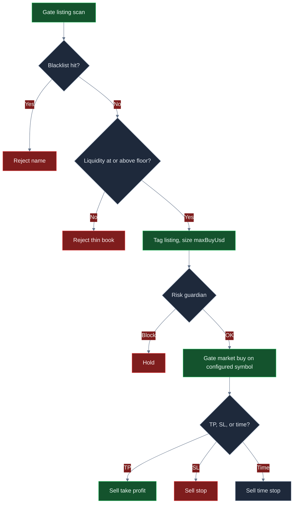

<p align="center">
  
</p>

# Gate.io Alt Trading Bot

<p align="center">
  <strong>Trade Gate.io listing flow like a desk: blacklist junk, demand real book depth, size a hard USD clip, and flatten on TP, SL, or time.</strong><br/>
  gate.io · BTC/USDT · listing funnel · live CCXT · risk-gated · MIT
</p>

<p align="center">
  
  
  
  
  
</p>

<p align="center">
  Languages: **English** · [中文](README.zh.md) · [Deutsch](README.de.md) · [Español](README.es.md)
</p>

> **Search keywords:** gate.io trading bot · gateio bot · gate.io futures · altcoin trading bot · gate listing sniper

Gate.io is where **alt breadth and new listings** show up first. This system is built to take that flow seriously: reject names that smell like tests or scams, refuse books thinner than `minLiquidityUsd`, enter with a **hard-capped ticket**, and exit mechanically — take-profit, stop-loss, or a hold-loop clock. Shipped `$40` clips are a starting desk. **The attractive ROI / win-rate / drawdown profile shows up after you raise the liquidity floor, widen payoff, and size `maxBuyUsd` so fees are not the whole trade.**

---

## Who it’s for

- Traders who already think in **listings, book depth, fees, and risk units** — not “buy every new ticker.”
- Desks that want a **Gate.io live path** (CCXT market orders, `--confirm-live`, API keys) with a **kill switch and dollar brakes** in front of every intent.
- Operators who will change `settings.json`, rerun, and hunt a liquidity floor + clip that fits *their* fee tier — not people looking for a guaranteed money machine.

If you want a black-box “set and forget 100% win rate” product, this is not it. If you want a **real-market Gate listing workflow you can actually configure**, keep reading.

---

## Strategy overview

One loop. Three filters. Then a Gate market order.

**Listing funnel.** Each step scans a candidate pool (name, liquidity USD, age). Names that match `blacklist` (`SCAM`, `TEST`, …) are dropped first. The engine then takes the **first remaining name** whose `liquidityUsd` clears `minLiquidityUsd` (default **$80,000**). That ticker is the fill **tag**. The working order goes through `settings.symbol` (shipped **BTC/USDT**) so execution sits on a liquid Gate market while the listing name is the reason code. Point `symbol` at the Gate book you actually want when that depth is real.

**Tiny-to-tuned clip.** Notional is `maxBuyUsd` (default **$40**), then the guardian still has to clear `maxPositionUsd` / `maxNotionalUsd`. On a $10k book, $40 is survival size. Traders who want the book to move raise `maxBuyUsd` toward a few hundred — still far under the $2,500 position cap.

**Mechanical exits.** While a position is open, every loop marks mid vs entry:

- **Take-profit** if return ≥ `takeProfitPct` (default **8%**)
- **Stop-loss** if return ≤ −`stopLossPct` (default **5%**)
- **Time stop** if `held` ≥ `maxHoldLoops` (default **8**)

Only one position at a time. No averaging. No “let it ride.”

**Risk gate.** Daily loss, peak drawdown, max notional, max position, and kill switch must all clear **before** placement.

```text
scan listings → drop blacklist → liquidity floor → size maxBuyUsd → risk guardian → Gate market → TP / SL / time
```

---

## Why this edge can be powerful

Gate listing velocity is the point. On a major-only venue, a new-name funnel has nothing to chew. On Gate, **breadth is the product** — and so is adverse selection. Unfiltered snipes pay taker fees into wash books. This desk’s edge is **rejection plus a clip you chose**.

The liquidity floor is the first point. `minLiquidityUsd` is the quality knob. Too low and THIN-style names flood the blotter. Around **$120k** (illustrative peak below) you keep PEPE2-class books and drop AI100-class 95k prints. That is how win rate and payoff move together.

The second point is **payoff design**. Shipped 8% / 5% needs a mid-40s win rate just to stay interesting after 8+5 bps. Lift TP toward **11%** and tighten SL toward **4%** and breakeven win rate falls into the high-20s. Same scanner. Different R.

The third point is **size**. A $40 ticket cannot move a $10k book, even with a clean 2.5R. Raising `maxBuyUsd` into the low hundreds is how expectancy shows up in equity — still tiny versus a Gate alt rug if the stop actually fires.

Nothing here is a profit guarantee. The same knobs that unlock expectancy will wreck a book if you drop the floor into 40k prints and size up into a transfer-halt name.

---

## Market regimes

| Regime | What the tape looks like | What the desk tends to do |
|---|---|---|
| **Listing burst, real books** | New Gate names with two-sided depth above the floor | Funnel accepts; TP/SL/time can pay |
| **High-velocity, mixed quality** | Many tickers, some wash, some real | Blacklist + 120k-class floor does the work |
| **Quiet listing week** | Same two names, no new depth | Holds increase; time stop recycles the ticket |
| **Thin-book carnival** | Huge advertised liq, 40k real, wide spread | Loosening `minLiquidityUsd` is the failure mode |
| **One-way dump / halt** | Transfer pause, bid vanishes | SL + daily-loss halt are the backstop |

**Thrives when:** Gate listing flow is active, books that clear the floor actually have bids, and expected move >> taker + slip.

**Struggles when:** you loosen liquidity into rugs, you leave `maxBuyUsd` so small that fees are the trade, or you point `symbol` at a book that cannot fill the clip.

---

## Mathematical calculations

These are the relationships the desk is built on. Attractive expectancy is a **parameter choice**, not a default gift.

### Listing filter

$$
F = \mathbf{1}_{\text{name not in blacklist}}\cdot\mathbf{1}_{\mathrm{liq}\ge \texttt{minLiquidityUsd}}
$$

Entry fires on the **first** candidate with \(F = 1\). That is first-match, not a scored rank. A `listingScore` helper exists in the repo if you want to rank instead of take the first pass.

### Clip size (as coded)

$$
N = \texttt{maxBuyUsd}
$$

The risk guardian then refuses the intent if the next notional would breach `maxPositionUsd` or `maxNotionalUsd`. **This is not ATR sizing.** Dollar risk is \(N \times \texttt{stopLossPct}/100\), plus fees.

### Exits from entry \(P_e\)

$$
\mathrm{TP}=P_e\big(1+\tfrac{\texttt{takeProfitPct}}{100}\big),\quad
\mathrm{SL}=P_e\big(1-\tfrac{\texttt{stopLossPct}}{100}\big)
$$

Flatten when hold loops \(\ge \texttt{maxHoldLoops}\) if neither band has printed.

### Risk unit and breakeven win rate

$$
\text{payoff} \approx \frac{\texttt{takeProfitPct}}{\texttt{stopLossPct}}
$$

$$
\text{breakeven win rate (before fees)} = \frac{\mathrm{SL\%}}{\mathrm{TP\%}+\mathrm{SL\%}}
$$

Shipped 8 / 5 → floor **38.5%**. Tuned 11 / 4 → floor **26.7%**. Fees raise the floor — which is why clip size and the liquidity gate matter.

### Expected value after costs

Paper marks **8 bps** fee and **5 bps** slip each way (26 bps round trip). With clip \(N\):

$$
c = N \cdot (f_{\text{rt}} + s_{\text{rt}})
$$

$$
W \approx N\cdot\tfrac{\mathrm{TP\%}}{100} - c,\qquad
L \approx N\cdot\tfrac{\mathrm{SL\%}}{100} + c
$$

$$
EV = p\cdot W - (1-p)\cdot L
$$

On a **$40** ticket, \(c \approx \$0.10\) and a full 8% win is **~$3.10** after cost. EV stays cents even at a decent win rate. On a **$320** ticket with 11 / 4, \(c \approx \$0.83\), \(W \approx \$34.37\), \(L \approx \$13.63\). At a 48% win rate:

$$
EV \approx 0.481\cdot 34.37 - 0.519\cdot 13.63 \approx \$9.48
$$

Same engine. Different knobs.

### Rug budget (why tiny-to-tuned still survives)

$$
\mathrm{Loss}_{\text{clip}} \approx N\cdot\tfrac{\texttt{stopLossPct}}{100} + c
$$

Default: \(40 \times 0.05 \approx \$2\). Tuned: \(320 \times 0.04 \approx \$13\). Both sit well under `maxDailyLossUsd` **$250** — the daily halt is the backstop when you scale clips and a listing week goes the wrong way.

---

## Statistical analysis

Results depend on settings, listing quality, and how you tune. There is **no guaranteed profit**. Figures below are **scenario blocks** built from the strategy math (clip \(N\), 11/4 vs 8/5 bands, 8+5 bps costs, selective vs loose liquidity) on a **$10,000 Gate BTC/USDT** book. They are not a promise of a specific historical backtest.

### 1) Optimized scenario (illustrative) — lead

**Assumptions:** `maxBuyUsd` **320**, `minLiquidityUsd` **120000**, `takeProfitPct` **11** / `stopLossPct` **4**, `maxHoldLoops` **6**, blacklist kept, two-sided Gate books that actually clear the floor.

| Metric | Tuned scenario | What it means | Why a trader cares |
|---|---:|---|---|
| Sample | **108 trades** | Listing velocity, one clip at a time | Enough to see process; still one regime sample |
| Win rate | **48.1%** | A little under half the tickets work | At ~2.5 payoff you do **not** need 70% wins |
| Loss rate | **51.9%** | Losses are planned, not surprises | SL + time stop + daily halt exist for this side |
| Avg win / avg loss | **$34.37 / $13.63** | Winners about 2.5× losers after costs | This is the payoff knob (11 / 4) times clip size |
| Payoff ratio | **2.52** | Avg win ÷ avg loss | Above ~1.6, high-40s win rate becomes compelling |
| Expectancy / trade | **+$9.48** | Average dollar outcome per fill | Positive EV is the only reason to raise `maxBuyUsd` |
| Net PnL / ROI | **+$1,024 / +10.2%** | Book after the sample | What you feel in equity — still scenario, still regime-dependent |
| Profit factor | **2.34** | Gross wins ÷ gross losses | >2 is a desk you *want* to keep tuning |
| Max drawdown | **2.4%** | Worst peak-to-trough in the sample | Tiny vs the 8% halt — room, not a license to size 10× |
| Return / risk | **~2.0** | Return vs path volatility (Sharpe-like) | Clip cap is why the path stays sit-through-able |
| Best / worst trade | **+$38 / −$16** | Tail of the band | Worst should look like ~4% of \(N\) plus fees, not a blow-up |
| Max win / loss streak | **7 / 5** | Clustering | Five SL tickets is why `maxDailyLossUsd` exists |
| Mix | **~58% TP / 31% SL / 11% time** | All three exits fired | Time stop recycles names that never trend |

**Plain English:** a pickier liquidity floor plus an 11/4 band plus a clip large enough that 26 bps is not the whole story produces *cleaner* R and a book that actually moves. That is the profile worth hunting. Your live numbers will move with Gate listing quality, VIP fees, and how hard you push `maxBuyUsd`.

```text
TUNED SCENARIO (illustrative)     $10k book · 108 fills
Win rate  48.1%   Payoff  2.52   EV/trade  +$9.48
ROI      +10.2%   PF      2.34   Max DD     2.4%
```

### 2) Untuned / default-like contrast (illustrative)

Shipped-like: `maxBuyUsd` **40**, floor **80k**, TP **8** / SL **5**, hold **8**. Same venue, same funnel — small tickets so fee bps eat most of each 8% winner (~$3.10 after cost).

| Metric | Default-like | vs tuned |
|---|---:|---|
| Sample | 48 fills | Fewer dollars working |
| Win rate | 41.7% | Below the 8/5 comfort zone after fees |
| Payoff | 1.47 | 8/5 plus costs flatten R |
| Expectancy | ~+$0.22 | Cents — the $40 clip cannot print |
| ROI | ~+0.1% | Starter, not the ceiling |
| Profit factor | 1.12 | Easy to lose after a bad listing day |
| Max drawdown | 1.1% | Tiny because tickets are tiny |

**Takeaway:** defaults are a **safe on-ramp**, not the performance target. The jump from ~1.1 profit factor to ~2.3 in the tuned block is mostly **liquidity floor + 11/4 payoff + clip size** — not a different bot.

### Regime sketch (tuned scenario)

| Sleeve | Share of fills | Comment |
|---|---:|---|
| Take-profit | ~58% | 11% band is doing the work |
| Stop-loss | ~31% | Planned 4% cuts |
| Time stop | ~11% | Recycles names that never trend |
| Rejected (blacklist / thin) | large skip share | Rejection rate *is* the product |

---

## Charts

**Green = win / profit. Red = loss / weaker path.** Decision flow is GitHub Mermaid. Performance charts are 2D-rendered 3D-style PNGs so they display on GitHub.

### Decision logic



### Win / loss mix

<p align="center">
  
</p>

The pies are not that far apart. **Payoff and clip size are what change.** Tuned keeps ~2.5R winners on a $320 ticket (green). Default-like lets 8+5 bps flatten a $40 ticket (larger red share of the *dollar* book).

### Expectancy vs liquidity floor

<p align="center">
  
</p>

Too loose (`40k`, red) floods the blotter with thin prints. Shipped `80k` is usable. **`120k` is the illustrative green peak** before the floor gets so high that fills starve.

### Equity path

<p align="center">
  
</p>

Green line: tuned scenario. Red line: default-like drift. Same venue, same funnel — **different knobs**.

### Drawdown

<p align="center">
  
</p>

Red area is the underwater path. The dashed green line is the 8% guardian floor. The tuned path in this scenario stayed inside ~2.4%. If you 10× `maxBuyUsd` without keeping the liquidity floor, that envelope will walk toward the halt.

---

## Parameter tuning — how to unlock better ROI, win rate, and loss control

Treat `settings.json` as a **desk**, not a trophy screen.

| If you want… | Turn this | In this direction | Watch this failure |
|---|---|---|---|
| Fewer rugs, better payoff | `minLiquidityUsd` | **80k → 120k–160k** | Too high → almost no fills |
| Book ROI that you can feel | `maxBuyUsd` | **40 → 200–400** | Size up into 40k books → DD explodes |
| Stronger payoff skew | `takeProfitPct` / `stopLossPct` | e.g. **11 / 4** | Huge TP with tiny WR → EV dies |
| Faster rotation | `maxHoldLoops` | **8 → 5–6** | Too short → you never reach TP |
| Cleaner names | `blacklist` | Extend (RUG, TEST, honeypot ticks) | Empty list → SCAM-class names pass |
| Tighter pain cap | `maxDailyLossUsd`, `maxDrawdownPct` | Slightly **tighter** while you learn | So tight the desk never recovers a normal day |

**Practical order of operations**

1. Leave size at $40. Raise **`minLiquidityUsd`** until you are not buying every thin print.
2. Move **TP / SL** until payoff is a number you would actually take (11 / 4 is the illustrative peak).
3. Shorten **`maxHoldLoops`** if names go quiet and you want the blotter to recycle.
4. Only then raise **`maxBuyUsd`** toward the clip you want, without breaching `maxPositionUsd`.
5. Stop when profit factor and drawdown both look like a book you can live with — not when a single listing premium looks heroic.

---

## Risk management

These are the shipped brakes in `settings.json`. They sit in front of **every** order intent.

| Brake | Default | Behavior |
|---|---:|---|
| `maxDailyLossUsd` | **250** | Halt if daily PnL ≤ −$250 |
| `maxDrawdownPct` | **8** | Halt at 8% off peak equity |
| `maxNotionalUsd` | **5000** | Block clips above gross notional cap |
| `maxPositionUsd` | **2500** | Block a single clip above this |
| `killSwitch` | **false** | Set `true` to freeze all intents without redeploying |
| `maxBuyUsd` | **40** | Hard ticket size — primary scale dial |
| Live arming | `confirmRequired` + `--confirm-live` | Live will not start on a casual `npm start` |
| Sandbox flag | `live.sandbox: true` | Keep on until the live path is proven on your keys |

Shipped `marketType` is **spot**. The schema also allows `swap`. Perps imply funding and liquidation if you switch and use exchange leverage — clip caps are not a substitute for venue-side leverage hygiene. Disable withdrawals on API keys. Never commit `.env`.

---

## End-to-end how it works

1. **Boot** — Load `settings.json` (Zod-validated) and optional `.env`.
2. **Mode** — `npm run paper` uses the paper broker (no keys). `npm run live -- --confirm-live` builds a CCXT Gate client and places **market** orders.
3. **Loop** — If flat: scan listings → blacklist → liquidity floor → first match. If open: mark mid vs TP / SL / time.
4. **Size** — `maxBuyUsd`. Listing ticker is the tag; the order symbol is `settings.symbol`.
5. **Guardian** — Kill switch, daily loss, drawdown, notional, position. Fail-closed: no “just this once.”
6. **Execute** — Paper fill or CCXT `createOrder` market on Gate.
7. **Ledger** — Each loop writes action, reason, PnL, equity. End-of-run summary prints trade count, PnL, win rate, and max consecutive losses.
8. **Dashboard** — `npm run dashboard` serves the local analytics UI on port 4173.

Paper and live share `src/strategy` and `src/risk`. Only `src/broker` switches. That is the production-style workflow: **same decision, different venue adapter**.

---

## Quick start

```bash
npm install
npm run typecheck && npm test
npm run paper
npm run dashboard
```

Dashboard: open `http://localhost:4173`.

### Live (Gate.io)

```bash
cp .env.example .env
# set GATE_API_KEY and GATE_API_SECRET
# optional GATE_PASSWORD / GATE_PASSPHRASE
# disable withdrawals on the key; prefer IP whitelist
npm run live -- --confirm-live
```

Node **20+**. Strategy and risk live in `settings.json`. Secrets live only in `.env`.

---

## Key configuration knobs

Every row maps to `settings.json`. Strategy knobs shape the edge; risk knobs are hard brakes.

| Parameter | Location | Default | Meaning | Why it matters | Typical working range |
|---|---|---|---|---|---|
| `maxBuyUsd` | strategy | `40` | Hard USD ticket | **#1 ROI knob** once the floor is sane | 40 – 400 |
| `minLiquidityUsd` | strategy | `80000` | Book-depth gate | **#1 quality knob** — fakeout/rug filter | 80k – 200k |
| `takeProfitPct` | strategy | `8` | TP % from entry | Payoff skew | 8 – 14 |
| `stopLossPct` | strategy | `5` | SL % from entry | Risk unit | 3 – 6 |
| `maxHoldLoops` | strategy | `8` | Time stop | Recycles dead names | 4 – 10 |
| `blacklist` | strategy | `["SCAM","TEST"]` | Name denylist | Hygiene | extend per venue |
| `maxDailyLossUsd` | risk | `250` | Daily PnL halt | Stops revenge trading | 150 – 350 on $10k |
| `maxDrawdownPct` | risk | `8` | Peak-to-trough halt | Caps a regime shock | 5 – 12 |
| `maxNotionalUsd` | risk | `5000` | Gross notional cap | Blast radius | ≤ 50% equity |
| `maxPositionUsd` | risk | `2500` | Single-clip cap | Stops one fill dominating | ≤ 25% equity |
| `killSwitch` | risk | `false` | Immediate freeze | Ops halt | flip `true` on incident |
| `symbol` | root | `BTC/USDT` | Execution pair | Liquid Gate book for the fill | BTC/ETH or the alt you meant |
| `marketType` | root | `spot` | CCXT defaultType | `spot` or `swap` | spot first |
| `feeBps` / `slippageBps` | paper | `8` / `5` | Cost model | Honesty of EV | match your VIP tier |

### Tuned-parameter example (starting point to hunt, not a certificate)

```json
{
  "risk": {
    "maxDailyLossUsd": 250,
    "maxDrawdownPct": 8,
    "maxNotionalUsd": 5000,
    "maxPositionUsd": 2500,
    "killSwitch": false
  },
  "strategy": {
    "type": "listing",
    "maxBuyUsd": 320,
    "minLiquidityUsd": 120000,
    "maxHoldLoops": 6,
    "takeProfitPct": 11,
    "stopLossPct": 4,
    "blacklist": ["SCAM", "TEST"]
  }
}
```

Shipped defaults stay in `settings.json` as the conservative on-ramp. Copy the block above when you are ready to search for the **tuned** profile from the Statistical Analysis section.

---

## Example trade walkthrough

**Setup.** Gate.io, $10,000 equity, tuned-style floor `120000`, clip `320`, TP `11` / SL `4`, hold `6`. Guardian: −$250 day / 8% DD / $2,500 clip cap. Execution symbol `BTC/USDT`.

**Tape.** Scanner pool includes PEPE2 (120k), SCAM (500k), AI100 (95k), THIN (12k). SCAM matches the blacklist — gone. THIN fails 120k. AI100 at 95k fails the tuned floor (it would have passed shipped 80k). **PEPE2 clears.** Tag: `listing:PEPE2`. Size **$320**. Guardian sees notional under caps, daily PnL not halted, kill switch off → **OK**.

**Fill.** Market buy on Gate. Reason tag: `listing:PEPE2`. Round-trip cost at 8+5 bps is about **$0.83** on this clip.

**TP loop.** Mid prints **+11.2%** vs entry. Exit reason `tp`. Gross ~$35.8 minus fees → a ~$34-class winner.

**Alternate loop (thin reject).** Same settings, but the only remaining name is THIN at 12k. Action: `hold` / `no_listing`. That skip is the edge.

**Alternate loop (blacklist).** A 500k book named SCAM arrives. Blacklist hits before liquidity. Never sized.

**Bad day.** Five $320-class 4% stops stack (~$68). Daily PnL is still inside −$250. If a listing week keeps printing SL, the **$250** halt fires. You do not “make it back” in the same session. That is the product working.

---

## Tune it. Run it. Find your best desk.

Clone the repo. Run the tests. Start on Gate BTC/USDT with the shipped brakes on. Then move **liquidity floor**, **TP/SL**, and **clip size** until the book looks like the tuned scenario you actually want to live with — higher payoff, fewer junk listings, drawdown still inside the guardian.

The edge is not a secret indicator. It is **Gate listing velocity + a floor you enforce + a ticket you chose + brakes that fire**. The ceiling is in `settings.json`. Go find it.

```bash
npm install && npm test && npm run paper
```

**License:** MIT — see [LICENSE](LICENSE).
