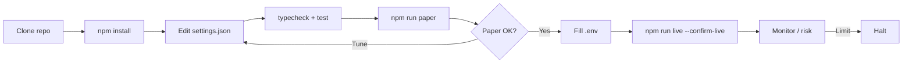
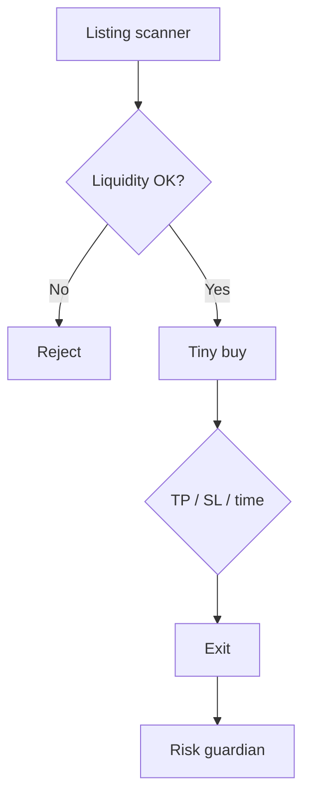

<p align="center">
  
</p>

# Gate.io Alt Trading Bot

<p align="center">
  <strong>Alt breadth with spot/futures dual-mode execution</strong><br/>
  gate · paper + live · risk-gated · MIT
</p>

<p align="center">
  
  
  
  
</p>

<p align="center">
  Languages: **English** · [中文](README.zh.md) · [Deutsch](README.de.md) · [Español](README.es.md)
</p>

> **Search keywords:** gate.io trading bot · gateio bot · gate.io futures · altcoin trading bot

---

## Performance snapshot

Demo analytics from the included static dashboard (`npm run dashboard`). Banners and strategy diagrams stay above/below.

<p align="center">
  
</p>

<p align="center">
  
</p>

<p align="center">
  
</p>

---

## Project workflow

Clone → configure → paper → credentials → live. Risk always on.



| | |
|--|--|
| `npm run paper` | Paper first — no API keys |
| `npm run dashboard` | Open local analytics dashboard (static) |
| `npm run live` | Requires `--confirm-live` + API credentials |

---

## Platform fit

| | |
|--|--|
| Venue | gate |
| Markets | both |
| Edge | Alt breadth with spot/futures dual-mode execution |
| Execution | CCXT live (sandbox preferred) + paper simulator |

---

## Trading strategy

MEXC and Gate.io win mindshare with **alt breadth and early listings**. This bot industrializes that workflow: scan candidates, **reject thin books and blacklisted names**, enter with a **tiny maxBuyUsd**, and exit mechanically on **TP / SL / time**. It is a controlled lottery ticket — not a portfolio core.

### How it works
- **Listing scanner** — Paper universe of new symbols with liquidity and age metadata (live: wire your venue’s announce/markets feed).
- **Liquidity guard** — Require `minLiquidityUsd` before entry.
- **Blacklist** — Keyword / ticker denylist (e.g. SCAM, TEST).
- **Tiny entry** — Hard-capped `maxBuyUsd`.
- **Mechanical exits** — Take-profit %, stop-loss %, or max hold loops.
- **Gate dual-mode helper** (Gate.io) — Prefer spot vs swap based on realized vol regime when extending the strategy.

### When the edge appears
**Best regime:** high-listing velocity markets where you accept many small scratches for a few outliers — only with money you can lose entirely.

### When it breaks down
**Fails when:** rugs, wash liquidity, transfer halts, or spreads wider than your TP. Early listings are adverse-selection heavy.

### Key parameters (`settings.json`)
- `maxBuyUsd`, `minLiquidityUsd`
- `takeProfitPct`, `stopLossPct`, `maxHoldLoops`
- `blacklist[]`

### Strategy-specific risk notes
- Assume most listing trades lose; size for ruin avoidance.
- Never enable withdrawals on API keys used for listing snipes.


---

## Strategy diagram



---

## Architecture

```
src/
  config/     Zod settings + env loader
  strategy/   venue-specific engine
  broker/     paper + CCXT live adapters
  risk/       daily loss / drawdown / caps
  app/        runtime loop
  alts/
  dual/
  liquidity/
```

---

## Quickstart

```bash
cd gate-io-alt-trading-bot
npm install
npm run typecheck
npm test
npm run paper
```

### Live

```bash
cp .env.example .env
# set GATE_API_KEY + GATE_API_SECRET
# optional GATE_PASSWORD / PASSPHRASE
npm run live
```

---

## Configuration

`settings.json` — strategy + risk + paper/live flags.  
`.env` — secrets only (see `.env.example`).

---

## Risk & safety

- Live refuses without `--confirm-live` and API credentials
- Prefer `live.sandbox: true` until proven
- Disable withdrawals on exchange API keys
- Daily loss / drawdown / notional caps + kill switch

---

## Disclaimer

Educational MIT software — **not financial advice**. CEX trading can cause total loss of capital.

## License

MIT — see [LICENSE](LICENSE).
