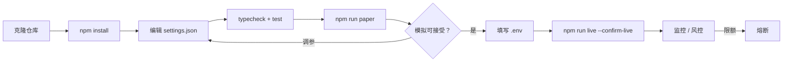
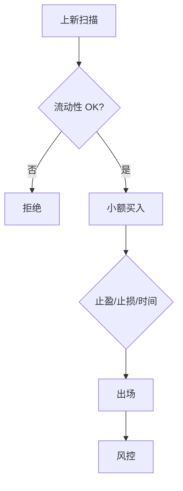

<p align="center">
  
</p>

# Gate.io 山寨交易机器人

<p align="center">
  <strong>山寨广度，现货/合约双模式</strong><br/>
  gate · paper + live · risk-gated · MIT
</p>

<p align="center">
  
  
  
  
</p>

<p align="center">
  语言: [English](README.md) · **中文** · [Deutsch](README.de.md) · [Español](README.es.md)
</p>

> **搜索关键词:** gate.io trading bot · gateio bot · gate.io futures · altcoin trading bot

---

## 项目工作流

克隆 → 配置 → 模拟 → 凭证 → 实盘。风控始终开启。



| | |
|--|--|
| `npm run paper` | 先跑模拟盘 — 无需 API Key |
| `npm run live` | 需要 `--confirm-live` 与 API 凭证 |

---

## 平台契合点

| | |
|--|--|
| 交易所 | gate |
| 市场 | both |
| 优势定位 | 山寨广度，现货/合约双模式 |
| 执行 | CCXT 实盘（优先 sandbox）+ 模拟盘 |

---

## 交易策略

MEXC 与 Gate.io 的心智是**山寨广度与早期上新**。本机器人将该流程产品化：扫描候选、**拒绝薄流动性与黑名单**、以极小 `maxBuyUsd` 入场，并按**止盈/止损/时间**机械出场。这是受控彩票，不是组合核心。

### 如何运作
- **上新扫描** — 含流动性与年龄元数据的候选池。
- **流动性守卫** — 低于 `minLiquidityUsd` 拒绝。
- **黑名单** — 关键词/代码拒绝。
- **极小入场** — 硬顶 `maxBuyUsd`。
- **机械出场** — TP%/SL%/最长持有。
- **Gate 双模式辅助** — 可按波动在现货/合约间扩展。

### 优势出现的条件
**适合：** 上新频繁、你能接受多数小亏换少数异常收益的市场；只用亏得起的钱。

### 何时失效
**失效：** Rug、假流动性、暂停充提、点差大于止盈。早期上新逆向选择严重。

### 关键参数（`settings.json`）
- `maxBuyUsd`/`minLiquidityUsd`
- TP/SL/持有循环
- `blacklist[]`

### 策略特有风险提示
- 默认多数上新交易亏损。
- 狙击用 API Key 禁止提现权限。


---

## 策略流程图



---

## 架构

```
src/
  config/     Zod settings + env loader
  strategy/   venue-specific engine
  broker/     paper + CCXT live adapters
  risk/       daily loss / drawdown / caps
  app/        runtime loop
  alts/
  dual/
  liquidity/
```

---

## 快速开始

```bash
cd gate-io-alt-trading-bot
npm install
npm run typecheck
npm test
npm run paper
```

### 实盘

```bash
cp .env.example .env
# set GATE_API_KEY + GATE_API_SECRET
# optional GATE_PASSWORD / PASSPHRASE
npm run live
```

---

## 配置

`settings.json` — strategy + risk + paper/live flags.  
`.env` — secrets only (see `.env.example`).

---

## 风险与安全

- Live refuses without `--confirm-live` and API credentials
- Prefer `live.sandbox: true` until proven
- Disable withdrawals on exchange API keys
- Daily loss / drawdown / notional caps + kill switch

---

## 免责声明

MIT 教育软件 — **不构成投资建议**。中心化交易所交易可能导致本金全部损失。

## 许可证

MIT — 见 [LICENSE](LICENSE)。
