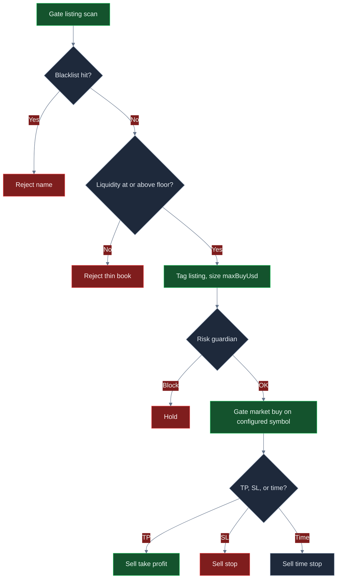

<p align="center">
  
</p>

# Gate.io 山寨交易机器人

<p align="center">
  <strong>像交易台一样做 Gate.io 上新：拉黑垃圾名、要求真实盘口深度、硬顶美元仓位，按止盈 / 止损 / 时间平仓。</strong><br/>
  gate.io · BTC/USDT · 上新漏斗 · 实盘 CCXT · 风控门控 · MIT
</p>

<p align="center">
  
  
  
  
  
</p>

<p align="center">
  语言: [English](README.md) · **中文** · [Deutsch](README.de.md) · [Español](README.es.md)
</p>

> **搜索关键词:** gate.io trading bot · gateio bot · gate.io futures · altcoin trading bot · gate listing sniper

Gate.io 是 **山寨广度和新上币** 最先出现的地方。本系统按这个流量来做：拒绝测试/骗局味道的名字，薄于 `minLiquidityUsd` 的盘口直接不要，用 **硬顶仓位** 进场，再机械出场——止盈、止损、或持仓循环时钟。出厂 `$40` 仓位只是起点。**有吸引力的 ROI / 胜率 / 回撤，来自你抬高流动性门槛、拉开赔率、并把 `maxBuyUsd` 调到手续费不再是整笔交易。**

---

## 适合谁

- 已经按 **上新、盘口深度、手续费、风险单位** 思考的交易者——不是“每个新 ticker 都买”。
- 要 **Gate.io 实盘路径**（CCXT 市价单、`--confirm-live`、API 密钥），并且每笔意图前都有 **熔断 + 美元刹车** 的交易台。
- 会改 `settings.json`、重跑、寻找匹配自己费率档的流动性门槛 + 仓位的人——不是来找“保证赚钱机器”的人。

如果你要的是黑盒“一键 100% 胜率”，这不是它。如果你要的是 **可以真正配置的 Gate 上新工作流**，继续往下读。

---

## 策略概览

一轮循环。三道过滤。然后一张 Gate 市价单。

**上新漏斗。** 每一步扫描候选池（名称、流动性美元、年龄）。先丢掉命中 `blacklist`（`SCAM`、`TEST` …）的名字。引擎再取 **第一个** `liquidityUsd` 过 `minLiquidityUsd`（默认 **$80,000**）的剩余名字。该 ticker 是成交 **标签**。真正下单走 `settings.symbol`（出厂 **BTC/USDT**），执行落在流动性好的 Gate 市场上，上新名只是原因码。当目标盘口深度真实时，把 `symbol` 指到你真正想做的 Gate 品种。

**从小到可调的仓位。** 名义是 `maxBuyUsd`（默认 **$40**），风控仍要过 `maxPositionUsd` / `maxNotionalUsd`。在 $10k 账上，$40 是生存仓。想让权益动起来的人，把 `maxBuyUsd` 抬到几百——仍然远低于 $2,500 单仓上限。

**机械出场。** 持仓期间，每轮用中间价对入场价：

- **止盈** 若收益 ≥ `takeProfitPct`（默认 **8%**）
- **止损** 若收益 ≤ −`stopLossPct`（默认 **5%**）
- **时间止损** 若 `held` ≥ `maxHoldLoops`（默认 **8**）

同一时间只有一笔仓。不加仓。不“让它飞”。

**风控门。** 日亏损、峰值回撤、最大名义、最大单仓、熔断，必须全部通过 **才能** 下单。

```text
扫描上新 → 丢掉黑名单 → 流动性门槛 → 按 maxBuyUsd 下单 → 风控守卫 → Gate 市价 → TP / SL / 时间
```

---

## 为什么这套优势可以很强

Gate 的上新速度才是重点。只有主流币的交易所，新名字漏斗没有东西可嚼。在 Gate，**广度就是产品**——逆选择也是。不过滤的狙击，等于把吃单费交给对倒盘。本交易台的优势是 **拒绝 + 你选定的仓位**。

流动性门槛是第一点。`minLiquidityUsd` 是质量旋钮。太低，THIN 一类名字会灌满成交单。大约 **$120k**（下方示意峰值）能留下 PEPE2 级别的盘口，丢掉 AI100 一类 95k 的打印。胜率和赔率会一起动。

第二点是 **赔率设计**。出厂 8% / 5% 在 8+5 bps 之后，需要中 40% 胜率才好看。把 TP 抬到 **11%**、SL 收到 **4%**，盈亏平衡胜率掉进 20% 高位。同一扫描器。不同 R。

第三点是 **仓位**。$40 票即使 2.5R 干净，也推不动 $10k 的账。把 `maxBuyUsd` 抬到低几百，期望值才会出现在权益上——如果止损真的打到，相对 Gate 山寨暴雷仍然很小。

这里没有任何利润保证。同样能打开期望值的旋钮，如果你把门槛降到 40k 打印、对着暂停提币的名字加仓，也会毁掉账本。

---

## 市场环境

| 环境 | 盘口长什么样 | 交易台倾向做什么 |
|---|---|---|
| **上新爆发、真实盘口** | 新 Gate 名字，双边深度过门槛 | 漏斗接受；TP/SL/时间可以兑现 |
| **高速度、质量混杂** | 很多 ticker，有对倒也有真的 | 黑名单 + 12 万级门槛在干活 |
| **上新冷清周** | 就那两个名字，没有新深度 | 持仓变多；时间止损回收仓位 |
| **薄盘狂欢** | 宣传流动性很大，真实 40k，点差很宽 | 放松 `minLiquidityUsd` 是失败模式 |
| **单边砸盘 / 暂停** | 暂停转账，买盘消失 | SL + 日亏损熔断是后盾 |

**适合：** Gate 上新活跃、过门槛的盘口真有买盘，且预期波动 >> 吃单 + 滑点。

**吃力：** 把流动性放到地毯单里、把 `maxBuyUsd` 留得小到手续费就是交易、或把 `symbol` 指到填不了仓位的盘口。

---

## 数学计算

交易台建立在这些关系上。有吸引力的期望值是 **参数选择**，不是出厂赠品。

### 上新过滤

$$
F = \mathbf{1}_{\text{name not in blacklist}}\cdot\mathbf{1}_{\mathrm{liq}\ge \texttt{minLiquidityUsd}}
$$

入场打在 **第一个** \(F = 1\) 的候选上。这是先匹配，不是打分排序。仓库里有 `listingScore` 辅助函数，若你想排序而不是取第一个。

### 仓位（按代码）

$$
N = \texttt{maxBuyUsd}
$$

若下一笔名义会突破 `maxPositionUsd` 或 `maxNotionalUsd`，风控守卫拒绝意图。**这不是 ATR 仓位。** 美元风险是 \(N \times \texttt{stopLossPct}/100\)，外加手续费。

### 从入场价 \(P_e\) 出场

$$
\mathrm{TP}=P_e\big(1+\tfrac{\texttt{takeProfitPct}}{100}\big),\quad
\mathrm{SL}=P_e\big(1-\tfrac{\texttt{stopLossPct}}{100}\big)
$$

两边都没打到、持仓循环 \(\ge \texttt{maxHoldLoops}\) 时平仓。

### 风险单位与盈亏平衡胜率

$$
\text{payoff} \approx \frac{\texttt{takeProfitPct}}{\texttt{stopLossPct}}
$$

$$
\text{breakeven win rate (before fees)} = \frac{\mathrm{SL\%}}{\mathrm{TP\%}+\mathrm{SL\%}}
$$

出厂 8 / 5 → 门槛 **38.5%**。优化 11 / 4 → 门槛 **26.7%**。手续费会抬高门槛——所以仓位和流动性门才重要。

### 成本后期望值

Paper 按每边 **8 bps** 手续费和 **5 bps** 滑点（往返 26 bps）。仓位 \(N\)：

$$
c = N \cdot (f_{\text{rt}} + s_{\text{rt}})
$$

$$
W \approx N\cdot\tfrac{\mathrm{TP\%}}{100} - c,\qquad
L \approx N\cdot\tfrac{\mathrm{SL\%}}{100} + c
$$

$$
EV = p\cdot W - (1-p)\cdot L
$$

**$40** 票上，\(c \approx \$0.10\)，完整 8% 赢约 **$3.10**（扣成本后）。即使胜率不错，EV 也是几美分。**$320** 票、11 / 4 时，\(c \approx \$0.83\)，\(W \approx \$34.37\)，\(L \approx \$13.63\)。48% 胜率：

$$
EV \approx 0.481\cdot 34.37 - 0.519\cdot 13.63 \approx \$9.48
$$

同一引擎。不同旋钮。

### 暴雷预算（为什么从小到可调仍能活）

$$
\mathrm{Loss}_{\text{clip}} \approx N\cdot\tfrac{\texttt{stopLossPct}}{100} + c
$$

默认：\(40 \times 0.05 \approx \$2\)。优化：\(320 \times 0.04 \approx \$13\)。都远低于 `maxDailyLossUsd` **$250**——当你放大仓位、上新周走错方向时，日熔断才是后盾。

---

## 统计分析

结果取决于参数、上新质量、以及你怎么调。**没有保证利润。** 下面是按策略数学（仓位 \(N\)、11/4 vs 8/5、8+5 bps 成本、严 vs 松流动性）在 **$10,000 Gate BTC/USDT** 账上构建的 **情景块**。不是某次历史回测的承诺。

### 1) 优化情景（示意）——先看这个

**假设：** `maxBuyUsd` **320**，`minLiquidityUsd` **120000**，`takeProfitPct` **11** / `stopLossPct` **4**，`maxHoldLoops` **6**，保留黑名单，过门槛的 Gate 盘口是双边真实的。

| 指标 | 优化情景 | 含义 | 交易者为什么在意 |
|---|---:|---|---|
| 样本 | **108 笔** | 上新速度，一次一仓 | 够看过程；仍是单一环境样本 |
| 胜率 | **48.1%** | 略少于一半票赚钱 | ~2.5 赔率下 **不需要** 70% 胜率 |
| 败率 | **51.9%** | 亏损是计划内的 | SL + 时间止损 + 日熔断就是为此 |
| 平均赢 / 平均亏 | **$34.37 / $13.63** | 赢大约是亏的 2.5 倍（扣成本） | 这是赔率旋钮（11 / 4）乘仓位 |
| 赔率 | **2.52** | 平均赢 ÷ 平均亏 | 高于 ~1.6 时，40% 高位胜率开始有吸引力 |
| 期望值 / 笔 | **+$9.48** | 每笔平均美元结果 | 正 EV 才是加大 `maxBuyUsd` 的理由 |
| 净盈亏 / ROI | **+$1,024 / +10.2%** | 样本后的账 | 你在权益上感受到的——仍是情景、仍依赖环境 |
| 盈亏比 | **2.34** | 毛盈利 ÷ 毛亏损 | >2 是你 *想继续调* 的台子 |
| 最大回撤 | **2.4%** | 样本中最差峰谷 | 相对 8% 熔断很小——有余量，不是 10 倍加仓许可证 |
| 收益 / 风险 | **~2.0** | 收益 vs 路径波动（类夏普） | 仓位帽让路径坐得住 |
| 最好 / 最差一笔 | **+$38 / −$16** | 带宽尾部 | 最差应像 ~4% 的 \(N\) 加费用，不是爆仓 |
| 最长连胜 / 连亏 | **7 / 5** | 聚集 | 五笔 SL 就是 `maxDailyLossUsd` 存在的原因 |
| 构成 | **~58% TP / 31% SL / 11% 时间** | 三种出场都打过 | 时间止损回收从未趋势的名字 |

**人话：** 更挑的流动性门槛 + 11/4 带宽 + 大到 26 bps 不再是全部故事的仓位，会给出 *更干净的* R，以及真的会动的账。这才是值得找的画像。你的实盘数字会随 Gate 上新质量、VIP 费、以及你把 `maxBuyUsd` 推多狠而变。

```text
TUNED SCENARIO (illustrative)     $10k book · 108 fills
Win rate  48.1%   Payoff  2.52   EV/trade  +$9.48
ROI      +10.2%   PF      2.34   Max DD     2.4%
```

### 2) 未调 / 偏默认对照（示意）

偏出厂：`maxBuyUsd` **40**，门槛 **80k**，TP **8** / SL **5**，持仓 **8**。同一交易所、同一漏斗——小票让手续费 bps 吃掉大部分 8% 赢家（扣成本后约 $3.10）。

| 指标 | 偏默认 | vs 优化 |
|---|---:|---|
| 样本 | 48 笔 | 工作中的美元更少 |
| 胜率 | 41.7% | 扣费后低于 8/5 舒适区 |
| 赔率 | 1.47 | 8/5 加成本压扁 R |
| 期望值 | ~+$0.22 | 几美分——$40 仓打不出成绩 |
| ROI | ~+0.1% | 起点，不是天花板 |
| 盈亏比 | 1.12 | 糟糕的上新日很容易亏 |
| 最大回撤 | 1.1% | 小是因为票就小 |

**结论：** 默认是 **安全上坡道**，不是业绩目标。从 ~1.1 盈亏比跳到优化块的 ~2.3，主要是 **流动性门槛 + 11/4 赔率 + 仓位**——不是另一套机器人。

### 环境素描（优化情景）

| 袖套 | 成交占比 | 说明 |
|---|---:|---|
| 止盈 | ~58% | 11% 带宽在干活 |
| 止损 | ~31% | 计划内的 4% 切割 |
| 时间止损 | ~11% | 回收从未趋势的名字 |
| 拒绝（黑名单 / 薄盘） | 很大跳过份额 | 拒绝率 *就是* 产品 |

---

## 图表

**绿色 = 赢 / 利润。红色 = 亏 / 更弱路径。** 决策流是 GitHub Mermaid。业绩图是带轻微 3D 景深的 2D PNG，以便在 GitHub 上显示。

### 决策逻辑



### 胜负构成

<p align="center">
  
</p>

饼图差得并不远。**真正变的是赔率和仓位。** 优化在 $320 票上保留约 2.5R 赢家（绿）。偏默认让 8+5 bps 压扁 $40 票（红在*美元*账上占比更大）。

### 期望值 vs 流动性门槛

<p align="center">
  
</p>

太松（`40k`，红）会用薄打印灌满成交单。出厂 `80k` 能用。**`120k` 是示意中的绿色峰值**，再高成交会饿死。

### 权益路径

<p align="center">
  
</p>

绿线：优化情景。红线：偏默认漂移。同一交易所、同一漏斗——**不同旋钮**。

### 回撤

<p align="center">
  
</p>

红区是水下路径。绿色虚线是 8% 守卫底。本情景优化路径停在约 2.4% 内。如果你把 `maxBuyUsd` 乘 10 却不守流动性门槛，这条包络会走向熔断。

---

## 参数调优 — 如何打开更好的 ROI、胜率和亏损控制

把 `settings.json` 当成 **交易台**，不是奖杯屏。

| 如果你想… | 拧这个 | 往这个方向 | 盯这个失败 |
|---|---|---|---|
| 更少地毯单、更好赔率 | `minLiquidityUsd` | **80k → 120k–160k** | 太高 → 几乎没成交 |
| 能感觉到的账本 ROI | `maxBuyUsd` | **40 → 200–400** | 对着 40k 盘口加仓 → 回撤爆炸 |
| 更强赔率倾斜 | `takeProfitPct` / `stopLossPct` | 例如 **11 / 4** | 巨大 TP 配极低胜率 → EV 死亡 |
| 更快轮转 | `maxHoldLoops` | **8 → 5–6** | 太短 → 永远打不到 TP |
| 更干净的名字 | `blacklist` | 扩展（RUG、TEST、蜜罐代码） | 空列表 → SCAM 类名字通过 |
| 更紧的痛感帽 | `maxDailyLossUsd`, `maxDrawdownPct` | 学习期略 **收紧** | 紧到正常日都恢复不了 |

**实操顺序**

1. 仓位先留 $40。抬 **`minLiquidityUsd`**，直到你不是在买每一张薄打印。
2. 动 **TP / SL**，直到赔率是你真会接受的数（11 / 4 是示意峰值）。
3. 若名字变安静、你想让成交单回收，缩短 **`maxHoldLoops`**。
4. 然后才把 **`maxBuyUsd`** 抬到你想要的仓，同时不破 `maxPositionUsd`。
5. 停在盈亏比和回撤都像你能长期坐的账——不是某一笔上新溢价看起来很英雄的时候。

---

## 风险管理

这些是 `settings.json` 里出厂的刹车。它们挡在 **每一笔** 下单意图前面。

| 刹车 | 默认 | 行为 |
|---|---:|---|
| `maxDailyLossUsd` | **250** | 日盈亏 ≤ −$250 则停 |
| `maxDrawdownPct` | **8** | 离峰值权益 8% 停 |
| `maxNotionalUsd` | **5000** | 超过总名义帽则拦 |
| `maxPositionUsd` | **2500** | 单笔超过则拦 |
| `killSwitch` | **false** | 设 `true` 即可冻结全部意图、不用重新部署 |
| `maxBuyUsd` | **40** | 硬票面——主缩放旋钮 |
| 实盘武装 | `confirmRequired` + `--confirm-live` | 随手 `npm start` 开不了实盘 |
| 沙盒旗 | `live.sandbox: true` | 在你的密钥上证明实盘路径之前保持开 |

出厂 `marketType` 是 **spot**。schema 也允许 `swap`。若你切换并用交易所杠杆，永续意味着资金费和强平——仓位帽替代不了交易所侧的杠杆卫生。API 密钥关闭提现。永远不要提交 `.env`。

---

## 端到端如何工作

1. **启动** — 加载 `settings.json`（Zod 校验）和可选 `.env`。
2. **模式** — `npm run paper` 用模拟经纪商（无需密钥）。`npm run live -- --confirm-live` 建 CCXT Gate 客户端并下 **市价** 单。
3. **循环** — 若空仓：扫描上新 → 黑名单 → 流动性门槛 → 第一匹配。若持仓：中间价对 TP / SL / 时间。
4. **仓位** — `maxBuyUsd`。上新 ticker 是标签；订单品种是 `settings.symbol`。
5. **守卫** — 熔断、日亏损、回撤、名义、单仓。失败即关：没有“就这一次”。
6. **执行** — 模拟成交或 CCXT `createOrder` 市价打到 Gate。
7. **账本** — 每轮写入动作、原因、盈亏、权益。结束摘要打印笔数、盈亏、胜率、最长连亏。
8. **仪表盘** — `npm run dashboard` 在 4173 端口提供本地分析 UI。

模拟和实盘共享 `src/strategy` 与 `src/risk`。只有 `src/broker` 切换。这就是生产式工作流：**同一决策，不同交易所适配器**。

---

## 快速开始

```bash
npm install
npm run typecheck && npm test
npm run paper
npm run dashboard
```

仪表盘：打开 `http://localhost:4173`。

### 实盘（Gate.io）

```bash
cp .env.example .env
# 设置 GATE_API_KEY 和 GATE_API_SECRET
# 可选 GATE_PASSWORD / GATE_PASSPHRASE
# 密钥关闭提现；建议 IP 白名单
npm run live -- --confirm-live
```

Node **20+**。策略和风控在 `settings.json`。密钥只放 `.env`。

---

## 关键配置旋钮

每一行都对应 `settings.json`。策略旋钮塑造优势；风控旋钮是硬刹车。

| 参数 | 位置 | 默认 | 含义 | 为什么重要 | 典型工作区间 |
|---|---|---|---|---|---|
| `maxBuyUsd` | strategy | `40` | 硬美元票面 | 门槛正常后的 **#1 ROI 旋钮** | 40 – 400 |
| `minLiquidityUsd` | strategy | `80000` | 盘口深度门 | **#1 质量旋钮** — 假突破/地毯过滤 | 80k – 200k |
| `takeProfitPct` | strategy | `8` | 距入场 TP % | 赔率倾斜 | 8 – 14 |
| `stopLossPct` | strategy | `5` | 距入场 SL % | 风险单位 | 3 – 6 |
| `maxHoldLoops` | strategy | `8` | 时间止损 | 回收死名字 | 4 – 10 |
| `blacklist` | strategy | `["SCAM","TEST"]` | 名称拒绝表 | 卫生 | 按交易所扩展 |
| `maxDailyLossUsd` | risk | `250` | 日盈亏熔断 | 阻止报复交易 | $10k 上 150 – 350 |
| `maxDrawdownPct` | risk | `8` | 峰谷熔断 | 盖住环境冲击 | 5 – 12 |
| `maxNotionalUsd` | risk | `5000` | 总名义帽 | 爆炸半径 | ≤ 50% 权益 |
| `maxPositionUsd` | risk | `2500` | 单仓帽 | 阻止一笔成交主导 | ≤ 25% 权益 |
| `killSwitch` | risk | `false` | 立即冻结 | 运维急停 | 出事时翻 `true` |
| `symbol` | root | `BTC/USDT` | 执行品种 | 成交用的流动 Gate 盘口 | BTC/ETH 或你想做的山寨 |
| `marketType` | root | `spot` | CCXT defaultType | `spot` 或 `swap` | 先现货 |
| `feeBps` / `slippageBps` | paper | `8` / `5` | 成本模型 | EV 的诚实度 | 匹配你的 VIP 档 |

### 优化参数示例（寻找起点，不是证书）

```json
{
  "risk": {
    "maxDailyLossUsd": 250,
    "maxDrawdownPct": 8,
    "maxNotionalUsd": 5000,
    "maxPositionUsd": 2500,
    "killSwitch": false
  },
  "strategy": {
    "type": "listing",
    "maxBuyUsd": 320,
    "minLiquidityUsd": 120000,
    "maxHoldLoops": 6,
    "takeProfitPct": 11,
    "stopLossPct": 4,
    "blacklist": ["SCAM", "TEST"]
  }
}
```

出厂默认留在 `settings.json` 作为保守上坡道。准备寻找统计分析里的 **优化** 画像时，复制上面这块。

---

## 示例成交走读

**设置。** Gate.io，$10,000 权益，优化风格门槛 `120000`，仓位 `320`，TP `11` / SL `4`，持仓 `6`。守卫：日 −$250 / 回撤 8% / 单仓帽 $2,500。执行品种 `BTC/USDT`。

**盘口。** 扫描池含 PEPE2（120k）、SCAM（500k）、AI100（95k）、THIN（12k）。SCAM 命中黑名单——去掉。THIN 不过 120k。AI100 在 95k 不过优化门槛（出厂 80k 会过）。**PEPE2 通过。** 标签：`listing:PEPE2`。仓位 **$320**。守卫看到名义未破帽、日盈亏未停、熔断关 → **OK**。

**成交。** Gate 市价买。原因标签：`listing:PEPE2`。8+5 bps 往返成本在这张票上大约 **$0.83**。

**止盈轮。** 中间价相对入场 **+11.2%**。出场原因 `tp`。毛利约 $35.8 减费用 → 约 $34 级赢家。

**另一轮（薄盘拒绝）。** 同样参数，只剩 THIN 12k。动作：`hold` / `no_listing`。这次跳过就是优势。

**另一轮（黑名单）。** 一个叫 SCAM 的 500k 盘口到来。黑名单在流动性之前命中。从未下仓。

**糟糕的一天。** 五笔 $320 级 4% 止损叠起来（约 $68）。日盈亏仍在 −$250 内。若上新周持续打 SL，**$250** 熔断开火。你不会在同一场里“赚回来”。那是产品在工作。

---

## 调参。运行。找到你的最佳交易台。

克隆仓库。跑测试。带着出厂刹车在 Gate BTC/USDT 上起步。然后拧 **流动性门槛**、**TP/SL** 和 **仓位**，直到账本看起来像你真正想长期坐的优化情景——更高赔率、更少垃圾上新、回撤仍在守卫内。

优势不是秘密指标。它是 **Gate 上新速度 + 你执行的门槛 + 你选定的票面 + 会开火的刹车**。天花板在 `settings.json`。去找它。

```bash
npm install && npm test && npm run paper
```

**许可证：** MIT — 见 [LICENSE](LICENSE)。
